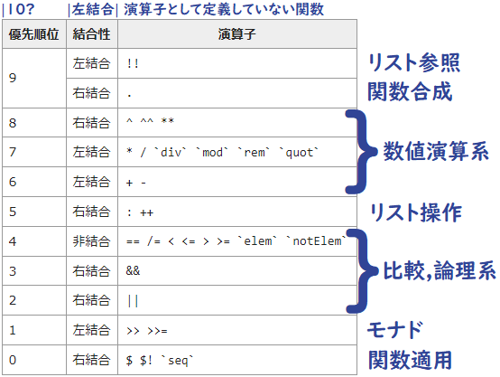
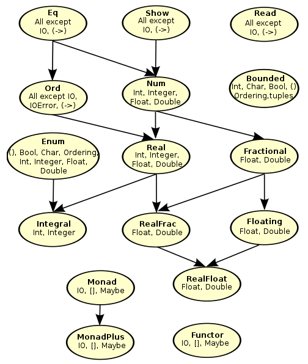
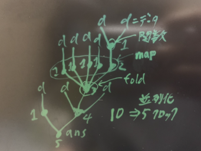
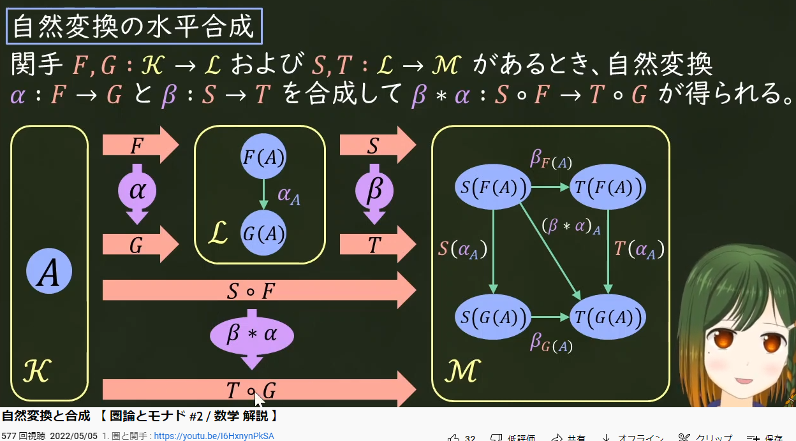

# Haskellまとめ

## サイト

## 構文

### 関数

- 関数とは、式に現れる変数に値を与える事によって式が具体的な値を表す仕組みです
**数学の関数**は`f(x) = x + 2`とか、`f(x,y) = x + y`とかで、
部分的にはHaskellも同じ仕組みをしています。
数学の分野の**ラムダ計算**は、カリー化もありこれも部分的にはHaskellも多分同じ仕組みをしています(計算行為上例外的な状況は多少ある..(ボトム(⊥)とか?))
詳しくは知らないが、Haskellは関数名もパターンマッチもカリー化もできるので、数学の関数とラムダ計算を足した感じ?

- 数学の関数とHaskellの関数とラムダ計算の比較
  - 数学の関数
  `f(x,y) = x + y`
  - Haskellの関数
  `f x y = x + y`
  - ラムダ計算
  `λxy.x + y`
  大体同じ

- Haskellの関数
```haskell
f :: Int -> Int -> Int -- 関数の型
f x y = x + y          -- 関数の定義
```
↓大体こんな感じです↓
`｢関数名｣ :: ｢引数1の型｣ -> ｢引数2の型｣ -> ｢式の型｣`
`｢関数名｣ ｢引数1｣ ｢引数2｣ = ｢式｣`

#### 式

- 式は関数の本体であり関数内の全ての処理がこの**一つの式に記述**されます。
`｢関数名｣ ｢引数..｣ = ｢式｣`
- 非関数型や数学の式と同じく式は、**必ず一つの値を返します**。
そこにいくつかの変数を引数として与えると、その与えられた引数に対応する値を返します。(式の中で**式の外の変数を参照しなければ**..)
  - なので、式は、**同じ引数に対しては必ず同じ値を返します**。これが**参照透過性**といわれています。

##### 優先順位

- 演算子には結合性と優先順位があります
  - **優先順位が高い演算子から評価**されていきます
  同じ優先順位の場合、結合性をみて、左結合だった場合は左から評価されます
  - 演算子の結合性と優先順位の設定は、`infix＠❰l¦r『結合性』❱ ❰0～9『優先順位』❱ ｢演算子("()"なし)｣` で定義します。(`❰l¦r❱`が無い場合は非結合。括弧`()`で囲む必要がある)
    - 関数は優先順位を設定(`infix`)できません
  - **関数は無条件で`infixl 10`です**。つまり、中置記法(`mod`など)にしたとき**一番優先順位が高く左結合**です
    - 中置記法にしない普通の関数の場合、関数の右に引数を並べるので、関数本体の式全体の左側(`=`のすぐ右)から関数が引数を取る数の分だけ取り評価しようとします
      - `f`が2引数,`g`が1引数,`a`と`b`が0引数を取る関数だとして、`f a g b`は`(f a g) b`と評価されてしまいますので、`f a (g b)`とする必要があります

- 演算子の優先順位

[](http://walk.northcol.org/haskell/operators/)

- 評価順序
1. 関数(fは関数)
`f 1 2 3` <=> `(((f 1) 2) 3)`(カリー化)
2. 演算子 (`infixl 6 +, infixl 7 *`)
`1 + 2 * 3` <=> `1 + (2 * 3)` <=> `(1 +) ((2 *) 3)` <=> `(+) 1 ((*) 2 3)` <=> `(((+) 1) (((*) 2) 3))`
3. 関数合成`(.)`と関数適用`($)`(`infixr 9 ., infixr 0 $`)(f,gは関数)
`f . g $ 1` <=> `(f . g) $ 1` <=> `(((f .) g) $) 1`
4. 同じ優先順位で結合性が互いに反対になるよう定義した演算子(`infixl 4 #<=#; a #<=# b = a + b;    infixr 4 #=>#; a #=># b = a * b;`)
`1 #<=# 2 #=># 4` => エラー, `1 #<=# (2 #=># 4)`(括弧`()`をして優先順位を明示すれば通る)

##### カリー化

- カリー化された関数とは、関数が必要とする**引数の数より少ない数の引数を渡す**と、残りの引数を必要とする**関数を返す関数**のことである(関数型ではこれが一般的)
  - 反対に関数が必要とする引数を同時に全て渡すのがアンカリー化された関数である(非関数型ではこれが一般的)
  - 圏論では`Uncurry : X × A -> B, Curry : X -> B^A (Xを与えるとHom(A,B)から射を一つ取り出す)`である

- C#版とHaskell版のカリー化を比べてみる
  - C#版
    ```csharp
    using System;
    public class M
    {
        public static void Main()
        {
            Console.WriteLine(Uncurrying(1,2,3));//=>5
            Console.WriteLine(Currying(1)(2)(3));//=>5
        }
        //アンカリー化        (Int,   Int,   Int)  ->  Int
        static int Uncurrying(int a, int b, int c) => a * b + c;
        //カリー化   Int -> (Int -> Int)           Int  ->   Int-> Int-> Int
        static Func<int, Func<int, int>> Currying(int a) => (b => (c => a * b + c));
    }
    ```
  - Haskell版
    ```haskell
    uncurryVal :: Int
    uncurryVal = uncurrying (1,2,3) -- => 5
    curryVal :: Int
    curryVal = currying 1 2 3 -- => 5

    uncurrying :: (Int, Int, Int) -> Int
    uncurrying (a, b, c) = a * b + c

    currying :: Int -> Int -> Int -> Int
    currying a b c = a * b + c
    ```
- ここで、引数を0個取る関数を作ってみます
  - C#版`int Five() => 5;`
  - Haskell版`five = 5`
  - Haskellでは、これ以外に`five`に`5`を関連付ける方法は無く、`=`は代入記号(コピー)ではなく
  数学の`=`と同じ意味の`five`は`5`であるという意味になります
  なので、`five`は引数を0個取る関数とも見えるし、`five`は`5`という値とも見え、
  Haskellでは**関数と値を区別しません**。なのでこれから**関数と言うとき引数が0個の関数も含める**場合があります

- Haskellの引数の記法
  - とりあえず、適当な関数を定義します
    - ```haskell
        func :: a -> b -> c -> ()
        func a b c  = () -- "()"は非関数型のnullのようなもの
        ```
    - そして`func`に一つづつ引数を与えて型を調べて行きます
    1. `:t func` => `func :: a -> b -> c -> ()`
    2. `:t func 1` => `func 1 :: b -> c -> ()`
    3. `:t func 1 2` => `func 1 2 :: c -> ()`
    4. `:t func 1 2 3` => `func 1 2 3 :: ()`
    つまり、関数に引数を与えるごとに以下のような関係があり、
    `((((func) 1) 2) 3)` <=> `(a -> (b -> (c -> (()))))`
    `a`を渡すと`b -> c -> ()`の関数を返す。`a b`を渡すと`c -> ()`の関数を返す
    よって、**どのくらい引数を与えるか**で**返される関数が決まります**
    なので非関数型と違って、引数を定義する順序は重要です
    それによって、他の関数の引数にできるかできないかが決まります(**合成可能性**)(まぁflip使えばできるけど)

##### 式の実態(ここでは引数0個の関数を値と呼んでいる)

- 式がどのように構成されて行くかを分解して観察してみる。以下の1.~10.は関数の`=`記号の右側 **(式)を表している**
小文字一文字のアルファベットまたは`(*)`は、0個以上の引数を取る**値または関数**で`❰f:2❱`という表記は`f`が2個の引数を取る関数とする。(`f :: a -> b -> c`)

1. 式は`a`という値を返す
    `a ❰a:0❱`
2. `f`が引数に`a`を取り値を返す
    `f a ❰f:1,a:0❱`
3. `f`が引数に`a`と`b`を取り値を返す
    `f a b ❰f:2,a:0,b:0❱`
4. `f`が引数に`a`を取り、もう一つ引数を取る関数を返す(カリー化の部分適用により関数が関数を返すこともある)
    `f a ❰f:2,a:0❱`
5. `(*)`が引数に`a`と`b`を取り値を返す
    `a * b ❰(*):2,a:0,b:0❱` => `(*) a b`
6. `(*)`が引数に`a`と`b`と`c`を取り値を返す(中置記法が2引数しか取らないとは限らない)
    `(a * b) c ❰(*):3,a:0,b:0,c:0❱` => `(*) a b c`
7. `g`が引数に`b`を取り値を返し、`f`が引数に`a`と`(g b)の返された値`を引数に取り値を返す
    `f a (g b) ❰f:2,g:1,a:0,b:0❱`
8. `g`が引数に`a`を取り、もう一つ引数を取る関数を返し、`f`が引数に`(g b)の返された関数`を引数に取り値を返す
    `f (g a) ❰f:1,g:2,a:0❱`
9. 内部の`(an1 an2..ann)`が値または関数を返し外部の`(b11..b1n)`が内部の`(an1 an2..ann)`を引数に取り値または関数をまた外部に返す
    `(..(b11..(a11 a12..a1n)..(a21 a22..a2n)..b1n..)..) ❰ann:0個から任意個の引数を取る❱`
10. `9.`をランダムに再帰的に拡張すると以下の様になり式というのは本当に**数学の数式と構造が同じ**である(ラムダ式、if,case式は関数の`=`の左側に追いやることができる。where,letは展開できる)
    `..(..(..)..(..(..)..(..)..)..(..(..)..(..)..(..(..)..(..)..(..)..)..(..)(..)..)..).. ❰..:関数または値、の列(0個から任意個の引数を取る関数の列)❱`
    つまり、式は、**関数と括弧**で構成するように書き直すことができる。
    当然そこには、他の非関数型言語で行う状態を保存したり取り出したりする**代入記号`=`は現れない(純粋関数型は状態を一切持たない(デフォルトスレッドセーフ?))**
    したがって、関数型の`=`は**何であるか**であり、非関数型の`=`は**何をするか**、である

- 合成a->b、適用a、

#### ラムダ式(メモコピペ)

- 引数は捨てることも可能
- スコープはラムダ式の始まり **(`\~`)から**(定義している関数本体の)**式の終わり**まで
  - 中置記法では無い**関数にラムダ式を適用**する場合は、ラムダ式に**括弧が必要**(またはBlockArgumentsを有効)(括弧に入れた場合は当然スコープもその括弧内)
- `\x -> x`のように引数とラムダ式本体に同じ変数が現れる場合は**キャプチャしない**そうで無い場合はキャプチャしている
- 優先順位(infix＠❰l¦r❱)は関係なし

#### マッチ

- マッチは、値を変数に束縛する時、`=`の左側の構文によって値をどの様に束縛するかを決めます

1. **値**を束縛
`a = 1` => `a = 1`
`a = Just 1` => `a = Just 1`
2. **値引数**を束縛
`Just a = Just 1` => `a = 1`
3. **値引数の値引数**を束縛 (オブジェクト指向で例えると`a = Just.Just.1`?)
`Just (Just a) = Just (Just 1)` => `a = 1`
`[a,b,c] = [1,2,3]` => `a = 1, b = 2, c = 3`
4. **複数の値引数**を束縛
`(a,b,c) = (1,2,3)` => `a = 1, b = 2, c = 3`
5. **ワイルドカード`_`**への束縛
`_ = 1` => なし
`(a,_,c) = (1,2,3)` => `a = 1, c = 3`
6. asパターン`@`への束縛
`all@(a,b,c) = (1,2,3)` => `all = (1,2,3)`

#### パターンマッチ

- パターンマッチは、関数に渡さっる値により評価する式を変えることによって**処理を分岐**します。(必ず値を返すswitch文に近い構文です)
  - パターンマッチは**上からマッチ**するか判定し、`マッチされる値(変数付き) == 渡される値`が`True`になればそれに**対応する式が評価**されます。
- この**パターンマッチとガード**でHaskellは全ての分岐を表現できます(非関数型の三項演算子`?:`に非常に近い)
- パターンマッチは**引数に対する結果の対応付け**であり、**原始的な演算**と見ることもできる?
  - もっと厳密にいうと、直和型の値で場合分けする?
- 多相変数に何か演算することはできない

1. **具体型の値**によるパターンマッチ
    ```haskell
    f1 :: Bool -> ()
    f1 True = ()
    f1 False = ()
    ```
2. **文脈の値**によるパターンマッチ
    ```haskell
    f2 :: Maybe a -> ()
    f2 (Just a) = ()
    f2 Nothing = ()
    ```
3. **文脈の文脈の値**によるパターンマッチ
    ```haskell
    f3 :: Maybe (Maybe a) -> ()
    f3 (Just (Just a)) = ()
    f3 (Just Nothing) = ()
    f3 Nothing = ()
    ```
4. **型**によるパターマッチはできない
    ```haskell
    f4 :: a -> Int
    f4 a = 1
    -- f4 True = 2  -- "a"を特定の型にすることはできない (Haskellはダウンキャスト禁止)
    -- f4 "abc" = 3   -- (==) :: a -> a -> Bool より a -> ❰Bool¦String❱ -> Bool となって(==)を評価できない
    ```
5. **型クラス内の型**によるパターンマッチはできない
    ```haskell
    f5 :: Show a => a -> String
    f5 a = show a
    -- f5 True = show True  -- "Show a"を特定の型にすることはできない
    -- f5 "abc" = show "abc"
    ```

#### [ガード](http://walk.northcol.org/haskell/expressions/#_%E3%82%AC%E3%83%BC%E3%83%89case_%E5%BC%8F)

- ガードはパターンマッチに成功した時に**束縛された変数**をBoolを返す関数に渡し、**上からTrue**になった行に**対応する式を評価**します
  - パターンマッチと比較すると、変数に**束縛しない**、`==`だけでなく**任意のBoolを返す関数**を使える
  - `g |True = ()` <=> `g | otherwise = ()` => `otherwise == True -- => True`

#### 主要な関数

```haskell
-- 恒等関数(恒等射)
id x = x

-- 関数適用
infixr 0 $
($) :: (a -> b) -> a -> b
f $ a = f a

-- カリー,アンカリー化
curry f (a,b) = f a b
uncurry f a b = f (a,b)

-- 関数合成(射の合成)
(.) :: (b -> c) -> (a -> b) -> (a -> c)
f . g = \x -> f (g x)

-- Functor(射の関手)
fmap :: (a -> b) -> f a -> f b
-- (Maybeの実装の場合)
fmap f Nothing = Nothing
fmap f (Just) a = Just (f a)
-- (リストの実装の場合)
fmap = map -- (map f [] = []; map f (x:xs) = f x : map f xs)

-- Applicative
pure :: a -> f a
(<*>) :: f (a -> b) -> f a -> f b
-- (Maybeの実装の場合)
pure a = Just a
Nothing <*> _ = Nothing
Just f <*> a = fmap f a
-- (リストの実装の場合)
pure a = [a]
[] <*> _ = []       -- fs,xsなど二重ループしたかったら二重再帰ループか?(fs<*>とfmap xs)
(f:fs) <*> xs = fmap f xs ++ (fs <*> xs)

-- Monad (クライスリトリプル)
return :: a -> m a
(>>=) :: m a -> (a -> m b) -> m b -- m a -> m b で"m"==モナドに閉じ込めている。その過程で">>="が"m a"の中身の"a"を取り出し"a -> m b"(ユーザー定義関数)を実行
-- (Maybeの実装の場合)
return a = Just a
Nothing >>= _ = Nothing
Just a >>= f = f a
-- (リストの実装の場合)
return x = [x]
xs >>= f = concat (map f xs) -- "join . fmap ｢クライスリ射｣" の形 ("join . fmap"は、"a -> m b" を "m a -> m b" にする(joinはμ))
-- (Stateの実装の場合)
newtype State s a = State {runState :: s -> (a, s)}
return x = State $ \s -> (x, s)                -- ↓"h"の中に"s -> (a, newState)"が畳み込まれている?-- \s2 -> f2 ((\s -> f (h s)) s2) <=> f2 . f . h 関数合成に似ている
State h >>= f = State $ \s -> let (a, newState) = h s in runState (f a) newState
-- Stateモナドはカリー化の随伴から作る。F(x) = X × S(アンカリー), G(Y) = Y^S(カリー), T(A) = G ○ F(A) = G(A × S) = (A × S)^S, s -> (a, s)

-- モノイド
mappend :: m -> m -> m -- m a -> m b -> m cにはなっていない、モノイドはモノイドの中身まで言及していない
mempty :: m
mconcat :: [m] -> m -- モノイドの畳み込み
mconcat = foldr mappend mempty
-- (Sumの実装の場合)
mempty = Sum 0
Sum a `mappend` Sum b = Sum $ a + b
-- foldMap(モノイドにマップして畳み込み)
foldMap :: Monoid m => (a -> m) -> [a] -> m
foldMap f xs = mconcat $ map f xs
```

### 代数的データ型

- データ型は、Haskellの全ての型とその値を定義します。(値そのものを定義できます)
- 型ですがC#のような関数もフィールドも持ちません(**状態を持たない**)。**定義しているのは値の型**です。int型やEnumを定義しているような感じです
  - C#で直和型は作れませんが共用体(Union型)で作れそう(先頭アドレスにEnumを仕込み今なんの値か判定する)
- 値コンストラクタはC#と比較して`new Struct(1,2,3) == Struct 1 2 3`のようなものですが、`Struct`は型ではなく値を作る関数です
- 型は圏論でいう対象(点)にあたります
  - 型コンストラクタは対象の関手にあたります(射の関手はfmap)

1. 最もシンプルなデータ型
    - 型名と値名は大文字から始まります
    `data Type1 = A`
    - 値コンストラクタ名が型名と同じでもいい
    `data Type2 = Type2`
2. 値コンストラクタが複数のデータ型
   - 直和型によって、C#のEnumのように値を判別することができます
   `data Type3 = A | B | C`
3. 値コンストラクタが値引数を取るデータ型
    - `data Type4 = A Int`
4. 型コンストラクタが型引数を取るデータ型
    - 型引数はC#のジェネリックの型引数のようなものです
    型引数は小文字から始まります
    `data Type5 a b = A a b`
    再帰的なデータ型
    `data Type6 = A Type6 | Nil`
      - test
      ```haskell
      length_Type6 :: Type6 -> Int
      length_Type6 Nil = 0 
      length_Type6 (A a) = 1 + f a
      ```

#### 主要なデータ型

### [型クラス](http://walk.northcol.org/haskell/type-classes/)



- 型クラスとは、ある**型の集合が利用**する同じ型の構造を持つ**関数**(または定数)を定義します
  - つまり、**型の集まりについて関数を定義**します(それ以外の**普通の関数は、特定の型**について関数を定義する)
- C#のインターフェースとその実装に似ています
- {class=> m = f2 f1 a <=instance} : m    //**複数の文脈**(と型)が**一つの型**として表すこともある
  {class=> m = f2 f1 <=instance}   : m a  //**型クラスが文脈**になり、**型引数を要求**することもある

```haskell
-- "Interface"がこの型クラスの名前になり、"i"にある型の集合が入ります
-- "Show i =>" は関数の型制約と同じく、"i"が"Show"型クラスのinstanceであることを要求します(C#の型制約(where)に似ています)
    -- これにより、"i"は"Show"型クラスが定義する関数を利用できます。
    -- この関係を継承関係と見ることもできるし、"Interface" ⊂ "Show"("Interface"は"Show"の部分集合である)と見ることもできます
class Show i => Interface i where
    value :: i
    -- strval :: String  -- "i"に関係のない関数は書けません(型に"i"が必ず現れる必要がある(多分))
    odoroki :: i -> String
    odoroki a = show a ++ "!!" --デフォルト定義。C#のデフォルト定義と同じ
    ifunc :: i -> i -> String

class Wrapper w where
    wrapper :: a -> w a  -- 型クラス変数"w"は、具体型でなく文脈(抽象型)としても定義できます。(w = Maybe a ではなく w = Maybe のような感じです)

-- Interface i => Interface Int に変え"i"に具体的な型を与えます(i = Int)
-- Int ∈ Interface と見ることもできます(値(1,2,3..) ∈ Int ∈ Interface ⊂ Show みたいな(Haskellの型のベン図が書けそう))
-- classで定義した関数をオーバーライドします
instance Interface Int where
    -- value :: Int     -- "i"に"Int"を適用しますので、classで定義した"i"が"Int"に置き換わった型になりますが、明示するとエラーになります
    value = 496
    -- ifunc :: Int -> Int -> String
    ifunc a b = show a ++ "," ++ show b

-- 使用
va = value :: Int -- => 496
od = odoroki (124 :: Int) -- => "124!!"
ic = ifunc (123 :: Int) (456 :: Int) -- => "123,456"

-- C#との比較: https://sharplab.io/#v2:C4LgTgrgdgNAJiA1AHwAICYCMBYAUHvDAAgCUiQiBhAewBtqwBvAXyOIHFyq6GW30iAIS416TVgHoJcAIbAZ3MUQC8pIsiKcNgvET36Dho8ZOnTUgBSUAxIGsGQPYMgF7dAMSqBo9UAyDIEJHQCIMgOwZA5gyAuwyAVwyARwyAPwyAqwyAxQyAXQyABwz+gBYRgH/OAJR4AJZQwACmYABmMgDGuUQAogCOAPoAPDIAfERSxFUA5EQKAO4AFvm5eIy6+gBG1HREuVMWCgAeMAoAnmkqTQCEubS5FvPLANxSsyrKqosqRFDUwEQAJERHyhKnw3pjE5vbcwtEy6tEG9NdmkDhIHk8fudLtc7g8ThCpIAAc0A8DqAGO1ABaKgCztQCV/nhmIQBKIGFwqnVCWAmlJsgBneRQUoVSodMlEXr9QYvNgAZiIb1ok2mzPmiiJv2UDQ5BlmADp2LlgAAVRYAB22KzhwGVuWoBQsJBWADJ9T8ZXLFSqLGrVBqVdrdWkAPxEYCQMogKRkE6qD1EeUuiX6aWyhWai3HJ2a23sA1GxYm4Pmy3hm06qOO50QV1STiezTnX0Z/16QOmkOJ61anWCaPGoNm1Vh8u2qtpl3kKTCHMdn1+3ASABUZhMgETCAyARYZAP0M4UAzwyAPYZAMMMgEGGQcj0x9iRFWhU3Ig6rHVS71QAMRkm4GuDx+FwxAAskNcAZUJgAGxsAAsRGvMmyFo5d5MADcZDAIhij0VQoFyLphTAC09kLIhAOA4DwMg0hYPgxCiAAc0hVD2HQ+9jEwkZcKgwQCJMeDHwATgsAAiXl+U+e5vmWOjgSozBaIsCwSVqMkGjSYo0ilKZtjAGAwDSYEpDFfMymaCRigABnOD04TIABaTTVnkzjuN4mp+J4ckhJEsSLAkrDpJBMVj1PRTikwNS91zbTVnsrd9J4wzSRMwThNE6YsJgEYbNkhpPLKKRigEVRszhYR3Lsk8vMIowaPoxiPhmFiljSdi4PSwxMp4viBLM0StksyTwqeSLUuipTuS9FRwS0nSUtPbyyqMirApyqy6rk1tHPfVrHniohkoaPTiofLifPK/zKpykKwpk+r5L0GKAFZzmzcEks62aewMC8LyAA===
data Color = R | G | B_

-- class    Eq' a     where
--              ↓  C#では、class Color : Eq'<Color> のようなinterface実装
-- instance Eq' Color where

class Eq' a where
    -- fail :: Int -> Int -- 引数に"a"を含めなければ実際に使われる時、型推論できない
    (===) :: a -> a -> Bool
    (=/=) :: a -> a -> Bool
    x === y = not $ x =/= y -- C#interfaceのデフォルト実装のような(Haskellでもデフォルト実装とよぶ)
    x =/= y = not $ x === y

-- fmapはC#でList<int>を引数にList<string>を返すような => interface Functor<f> {f<b> fmap<a,b>(Func<a,b> Arrow_ab, f<a> f_a);}
                                                                    -- //CS0307: 型パラメーター「f」は型引数と一緒に使用できません //文脈には関数を定義できない
-- instance Functor Maybe where -- :k Maybe => Maybe :: * -> *, :k Functor => (* -> *) -> Constraint
    -- fmap :: (a -> b) -> f a -> f b -- f a, f b のように、aを型引数に取っていてMaybeは型引数を一つ取るのでカインド(種類)が合う
-- instance (Eq m) => Eq (Maybe m) where --Maybe Int とか具体型を書かなくても、型引数?多相型?を使える。(Eq m) => はC#では、where m : Eqでジェネリックの型制約の様な
instance Eq' Color where
    R === R = True      -- "==="は上のclassの"==="をオーバーライドして実装している
    G === G = True
    B_ === B_ = True
    _ === _ = False

c0 :: Bool
c0 = R === R -- =>True
c1 :: Bool
c1 = R === G -- =>False
c2 :: Bool
c2 = G === B_ -- =>False

c3 :: Bool
c3 = R =/= R -- =>False
c4 :: Bool
c4 = R =/= G -- =>True
c5 :: Bool
c5 = G =/= B_ -- =>True
```

## その他考察

### 高階関数といろいろ(haskelltest.hsからコピペ)

```haskell
-- 高階関数と再帰================================================================================================================================
-- 青線の"Eta reduce"は役に立つ
-- "func1"は、0引数を取り、値(Value)を返す関数
func1 :: Type
func1 = Value
data Type = Value deriving(Show)
ret1 = func1 -- => Value
-- "func2"は、1引数を取り値(Value)を返す
func2 :: a -> Type
func2 x = Value
ret2 = func2 () -- => Value
-- "func3"は、1引数を取り、その引数を返す関数
func3 :: a -> a -- func3 :: a -> b はエラー。{a = "x"の型}とされるため?
func3 x = x
ret3 = func3 Value -- => Value
-- "f"が値を取り、値を返す関数
func4 :: (a -> b) -> a -> b
func4 f x = f x
ret4 = func4 show 4 -- => "4"
-- "f"が値を取り、関数を返す関数
func5 :: (a -> (b -> c)) -> a -> (b -> c)
func5 f x = f x
ret5 = func5 (*) 5 $ 4 -- => 20
-- "f"が関数を取り、値を返す関数 -- コールバック関数
func6 :: ((a -> b) -> c) -> (a -> b) -> c
func6 f g = f g -- func6 f = f でもok。"func6 f"は"(a -> b) -> c"型を返すから(ポイントフリースタイル)
ret6 = func6 (\g -> show.g $ 2) (8/) -- => "4.0"
-- "f"が関数を取り、関数を返す関数
func7 :: ((a -> b) -> (c -> d)) -> (a -> b) -> (c -> d)
func7 f g = f g
ret7 = func7 (\g -> (++).show.g $ 2) (8/) $ "th" -- => "4th"
--再帰==============================================================
-- "func8"は再帰関数
func8 :: (Eq a, Num a) => a -> a -- パターンマッチで"=="比較されるのでEq型クラス制約が必要?
func8 0 = 0
func8 n = func8 (n - 1)
ret8 = func8 8 -- => 0
-- "func9"は再帰しその結果を("+"で)畳み込む関数
func9 :: (Eq a, Num a) => a -> a
func9 0 = 0 -- "0" は 0 :: Num p => p と定義されている
func9 n = n + func9 (n - 1)
ret9 = func9 9 -- => 45
-- "func10"は、再帰しその引数の中で畳み込む関数
func10 :: (Eq a, Num a) => a -> a
func10 0 = 0
func10 n = func10' 0 n -- 畳み込むための引数が必要
    where
        -- func10' :: (Eq b, Num b, Num a) => a -> b -> a -- 期待された型 'a1'(aかな?) と実際の型 'b' が一致しませんでした。
                                                        -- 恐らく、{Eq b かつ Num b}な型と{Num a}な型が"+"演算子において型が唯一に定まらない可能性があるからだと思う
        func10' :: (Eq a, Num a) => a -> a -> a
        func10' e 0 = e
        func10' e n = func10' (e + n) (n - 1)
ret10 = func10 10 -- => 55
-- "func11"は、多重再帰関数(ノードとリーフに付いてる1を畳み込む)
func11 :: (Eq a, Num a) => a -> a
func11 0 = 1 -- リーフ
func11 n = func11(n - 1) + 1 + func11(n - 1) -- ノード
ret11 = func11 11 -- => 4095 (sum . map (2^) $ [0..11]) 
-- "test1 n m = n + m"の型=================================================================================================================
-- test1 :: Int -> Number -> Number -- 期待された型 'Number' と実際の型 'Int' が一致しませんでした。
    -- ↓確かに"1 + One"は定義されていない
data Number = One | Two deriving(Eq, Show)
instance Num Number where
    -- 恐らく、(+) :: (Num a) => Number -> a -> a のような型にはなっていない
    One + One = Two
    One + Two = One
    Two + One = One
    Two + Two = Two
numberTest :: Number; numberTest = One + One -- => Two
-- test1 :: Int -> Integer -> Integer -- 期待された型 'Integer' と実際の型 'Int' が一致しませんでした。-- ↑と同じ理由
-- test1 :: (Num a, Integral b) => a -> b -> b -- 期待された型 'a' と実際の型 'b' をマッチングできませんでした。
    -- {n + m} => {a + b} => {Num + Integral} => {型クラス1 + 型クラス1を継承した型クラス2}を、しようとしたが、"+"演算子はある特定の一つの型に対する定義なので、
    -- この場合、"型クラス1"は"型クラス2"の部分集合の型しか選択肢が無く"型クラス1"を"型クラス2"の差集合を取った場合、確実に"+"演算子に対して型が唯一に定まらずエラーとなる
test1 :: Num a => a -> a -> a
test1 n m = n + m
test2 :: Number -> Number -> Number
test2 n m = n + m
-- =========================================================================================================================================
data AType = ABC
-- data BType = ABC -- 同じ値は定義できないはず。0 :: Num p => p ?
-- whereネスト===============================================================================================================================
where' = where'1
    where
        where'1 = where'2 -- where'1 = where'4 はエラー
            where
                where'2 = where'3
                    where
                        where'3 = ()
                        where'4 = ()
-- 多分木を定義してみた=======================================================================================================================
data Tabunki a =  Node' a [Tabunki a]

tabunki :: Tabunki Int
tabunki = Node' 1 [Node' 2 [], Node' 3 [], Node' 4 [Node' 5 [Node' 6 [], Node' 7 []], Node' 8 [Node' 9 [], Node' 10 []]]]

tabunkiSagasu :: Int -> Tabunki Int -> Bool
-- tabunkiSagasu n (Node' a []) = a == n     -- 畳み込み(||) . マップ(tabunkiSagasu n)
tabunkiSagasu n (Node' a xs) = a == n || foldr ((||) . tabunkiSagasu n) False xs 
-- foldr万能すぎ(これだけでマップと畳み込みができる) {最初に考えたやつ->(foldr (||) False . map (tabunkiSagasu n)) xs}

hatiWoSagasu :: Bool
hatiWoSagasu = tabunkiSagasu 8 tabunki -- => True
-- =========================================================================================================================================
-- 引数再帰(万能?(自身の結果が出力の型と合わないとだめ))、外側再帰(fold出来るようなモノを外側にし、それと自身の結果を合わせて出力の型と合わないとだめ)、単位元、初期値、foldl、foldr 15
-- 多相変数に何か演算しようと思うなら型制約をする
sumList :: (Eq a, Num a) => a -> (a, [a])
sumList n = sumList' (0, []) n
    where
        sumList' (e, xs) 0 = (e, xs)
        sumList' (e, xs) n = sumList' (e + n, n:xs) (n - 1)
-- quot と rem , div と mod================================================================================================================
-- https://yomi322.hateblo.jp/entry/2012/10/18/204707
quotYRem :: Integral a => a -> a -> Bool
quotYRem x y = (x `quot` y) * y + (x `rem` y) == x -- => True
divYMod :: Integral a => a -> a -> Bool
divYMod x y = (x `div`  y) * y + (x `mod` y) == x -- => True
-- divの 5 `div` (-2) == -3 になるのは
    -- 5 / (-2) == -2.5 をマイナス方向に丸めると-3でdivと同じになる(modはその時の余り)
    -- 5 / (-2) == -2.5 をプラス  方向に丸めると-2でquotと同じになる(remはその時の余り)
    -- しかし、5 / 2 == (-5) / (-2) == 2.5 で商がプラスになるとdivもquotもマイナス方向に丸める
    -- 見方を変えると、divはマイナス無限方向に丸め、quotはゼロ方向に丸める(少数切り捨て)と見ることもできる
-- 畳み込み==================================================================================================================================
-- 値の畳み込み
foldVal = foldr (+) 0 [1,2,3,4]
-- 構造の畳み込み
foldStr = foldr (:) [] [1,2,3,4]
-- 関数の畳み込み
foldFunc = foldr (.) id [(\x->x+1),(\x->x*2),(\x->x+2),(\x->x*4)]
-- =========================================================================================================================================
```

### モナド

- `(>>=) :: Monad m => m a -> (a -> m b) -> m b`
- `>>=`は**モナドからモナド**という**モナドとしての処理**をしつつ、`>>=`によって**取り出された普通の値**を**ユーザー定義されたクライスリ射**`a -> m b`
によって**その値を自由に利用**し処理することができる。そしてまた**自由にそのモナドの文脈を付けて**、処理を`>>=`に戻す。
  - **モナド**(`>>=`)という**システムの中**で**ユーザー定義されたコードを実行**させる。と見ることもできる
- `>>=`の**定義方法**として、入力`m a`がモナド値で出力`m b`もモナド値なので(`>>=`)の**結果は`m a`と同じモナド文脈**としての構造を返さなければならない
  - do記法

    ```haskell
    listDo = do       -- クライスリ射へ取り出される所までが一行。上から実行される。
      op <- [(+),(*)] -- [(+),(*)] >>= (\op ->
      x <- [2,3]      -- [2,3] >>= (\x ->
      y <- [4,5]      -- [4,5] >>= (\y ->     [(+),(*)] >>= (\op ->[2,3] >>= (\x ->[4,5] >>= (\y ->[op x y])))
      [op x y]        -- [op x y])))          [op x y|op <- [(+),(*)], x <- [2,3], y <- [4,5]] と等価
    ```

  do記法は`｢モナド値｣ >>= (｢クライスリ射 >>= (｢クライスリ射 >>= ｢クライスリ射｣｣｣))`の様に**クライスリ射**と`>>=`が**ネスト状**になっていて、
  do記法は**一行づつ**クライスリ射と`>>=`を**実行を開始**して行き、**最後の行で同時に終わる**ような構造をしている。そうする事で、再帰関数のように
  複数のモナド文脈を伴った処理を**一つの`>>=`で処理**している様に見え、**外側で取り出された普通の値**は**どの行でも参照**することができる。
  **最後の行**は、クライスリ射の`\x -> ココ`にあたる部分になるため、取り出す記号`<-`は使えません。そしてこれが、再帰関数の最底のように
  クライスリ射と`>>=`が実行し終わった**最終結果**として一番外側の`>>=`まで返され、これが**do記法の結果のモナド値**となります。

#### IOモナド

キーボードから入力を受け取ったり、画面に出力したりする処理と言うのは具体的には、キーボードから入力されたデータをメモリに保存しそれをHaskellプログラムから
参照したり、画面に出力するために、Haskellプログラムからグラフィックデバイスドライバが参照するアドレス空間にデータを書き込むことである。(多分)
そのため、外の世界とインタラクティブな処理をするためには、Haskellプログラムのある部分つまり、**ある関数では外の世界と通信**するために、
特定のアドレス空間に対して読み書きし、**Haskellの中と外を繋がなく**てはならない。その結果、その関数では与える引数がおなじでも、毎回違う結果を返し
参照透過ではなかったり、**関数を実行すると**、外部に影響をあたえるという**副作用を伴う処理**をしたりする。(追記:副作用を伴う処理をすると
  言う**プログラムを返す**)(←の訂正:**現実世界という状態**を引数に取り、副作用を伴うプログラムを実行すると言う関数を返す)
そんな純粋関数型言語でも純粋ではない関数を実行しなければHaskellプログラムの結果を見ることもできないし、入力を与えることもできない。
では、どの関数が不純な処理を実行するのかというと、**IOという文脈が付いた値を解釈し実行する関数**である。
その関数が`>>=`(もしくは、それを作る型クラスのメソッド(多分))である。(訂正:`>>=`は**IOモナドを糊付け**しているだけで実行はしていない)
IOという文脈が付いた値には、具体的に**不純な処理を実行すると言うプログラムが書かれている**思われます。(想像)
例えば`IO ()`という型の値の中には`print("Hello_World")`のような画面に"Hello_World"と表示してくださいというプログラムが書かれているかも知れません
しかし、それは値であり関数ではないので、その値が自身のプログラムを勝手に実行する事はない。それと、その`IO`という文脈付きの値を作るには、
その`IO`という文脈を付ける関数、例えば、
引数に`"Hello_World"`と渡すと、`print("Hello_World")というプログラムが書かれた値`を返す`putStrLn :: String -> IO ()`関数があったり、
`getLine :: IO String`という`キーボードからの入力をStringとして受け取ります。というプログラムが書かれた値`という値があります。
その`IO`という文脈付きの値を引数にとり唯一`IO`型に書かれたプログラムを実行できる存在が`(>>=) :: Monad m => m a -> (a -> m b) -> m b`であり、
この`m`を`IO`に置き換えると`(>>=) :: Monad IO => IO a -> (a -> IO b) -> IO b`となります。これは、入力に`IO a`を取りその`IO a`の`a`を取り出すために
`IO a`型の**値の中に書かれたプログラムを実行**します。そして`a`を取り出します。この`a`は**外の世界から取ってきた(かもしれない)値**であり、これを
クライスリ射`(a -> IO b)`に適用しこの**クライスリ関数からHaskellプログラムの純粋な世界で処理**することができます。そしてまたクライスリ射が
`IO`というプログラムが書かれた値を作ります。そしてまたそれを`>>=`が実行し、っとなって不純な処理を実行するIOモナドの`>>=`と純粋な処理をするクライスリ射(関数)で
不純な処理をする特定の場所(`>>=`)と純粋な処理をする場所(クライスリ関数)を**綺麗に分ける**ことができ純粋な場所では参照透過性の恩恵を受けられます。
(正確には`>>=`も**IO型を返す**ので、**プログラムを実行するというプログラム(IO型の値)を返す**かも知れません。そのプログラムを実際の処理系で実行..。
つまりHaskellの全ての.exe形式で実行可能なプログラムソースコードはプログラム(IO型)を返す..(mainはIO型(プログラム)でなければならない理由)それと、
`main = putStrLn "Hello_World"` でも実行されるので`>>=`は複数のIO型(プログラム)順番に実行するために`>>=`で繋げて一つのIO型(プログラム)に纏める(糊付けする)だけかも知れない)
後、`>>=`は`IO a -> (a -> IO b) -> IO b`の`IO a -> IO b`というふうに`IO`の中に閉じ込められているため、
`iOFunc :: Maybe (IO String);iOFunc = Just (getLine >>= \x -> return x)`とやっても、Haskellの遅延評価により先に`getLine`が`>>=`で処理されず
(追記:`>>=`もプログラム(IO型)を返すだけで実行はしてない?)`IO b`を引数にとる関数はその出力も必ずIO型であり、IOから非IOを返す関数は存在しない(多分)し、
IO型を引数に取らない関数に与えると`getLine`が`>>=`で処理される前にエラーとなる?
IOから非IOを返す関数`IO a -> a`な関数が存在しないとすれば、ある部分の関数がIO型を返せばルートの関数(mainとか)にまでIO型もしくはIO型をもつ文脈が返る?
つまり、式木と関数スタックが、main -> 不純 -> 不純 -> 不純 -> 不純 -> 不純 -> 不純 -> 純粋 -> 純粋 -> 純粋 -> 純粋 -> 純粋 -> 純粋 -> 純粋 なイメージ
`"IO a -> a"`でググったら`unsafePerformIO :: IO a -> a`というやばげな関数が出てきたｗ
(追記:`unsafePerformIO`は、`unsafePerformIO iO = runIO iO realWorld`? {`runIO (IO f) realWorld = f realWorld`})
`❰import System.IO.Unsafe❱ unsafeExe :: String; unsafeExe = unsafePerformIO getLine ++ "!!"` 本当に`getLine`を実行している..
`unsafePerformIO`は本来、処理系が実行すべきもの? [禁断の機能「unsafePerformIO」の深淵](https://xtech.nikkei.com/it/article/COLUMN/20090512/329783/)

- [Haskell の IO モナドと参照透過性の秘密](https://www.timedia.co.jp/tech/haskell-io-monad/)
  - **現実世界という状態**?(RealWorld)を引数にし**Stateモナド風**の関数合成のような感じで、合成していき、**結果を値コンストラクタに出力**することで
  アドレス空間に書き込み?**画面に出力**していた?
  これだと**プログラムが完了するまで**画面に**出力できない**気がするし、入力も評価中に実行しなければならないので、**評価中に副作用が発生する実行をしている**だろう

### 並列性

- [「参照透明な言語は並列化可能なポイントを簡単に見分けることができる」](https://qiita.com/hiruberuto/items/26a813ab2b188ca39019)


## Haskell環境セットアップ(VScode)

(色々やったけどうまく言ったと思われるやつ)
- VScodeの拡張機能から、Haskell v2.2.0をインストール 右下から"Project requires GHC but isn't installed"と言われてエラーが出たのでリンクをクリックし
[GHCup](https://www.haskell.org/ghcup/)と言うやつに貼ってある
`Set-ExecutionPolicy Bypass -Scope Process -Force;[System.Net.ServicePointManager]::SecurityProtocol = [System.Net.ServicePointManager]::SecurityProtocol -bor 3072;Invoke-Command -ScriptBlock ([ScriptBlock]::Create((Invoke-WebRequest https://www.haskell.org/ghcup/sh/bootstrap-haskell.ps1 -UseBasicParsing))) -ArgumentList $true`
を、VScodeのターミナル(powershell)に貼りEnterキーを押す
最初に止めるか聞かれるので❰c❱を押した、その後デフォルトのパスにするか聞かれるので❰Enter❱を押した、後、色々インストールするけどいいか効いてくるでもよく分からないので適当に❰y❱を連打した
すると色々がちゃがちゃ始まってVScodeのHaskellのインストールが終わった見たいだ(完)
  - 他に(多分↑でインストールされるので**要らない**と思うが、)[native OS package manager](https://www.haskell.org/downloads/)の`Show Windows package`の`Chocolatey: GHC, cabal, Stack`をインストールした

## 純粋関数型と非関数型(C#)

### 状態(State)

- **状態を引数として渡す**ことで、関数は状態を持たず、**参照透過な関数**となる
  - 状態を持つ順序回路から、状態自体を渡すことで**組合せ回路**になったイメージ
    - (全加算器のキャリービットの受け渡しに似ている)
  - 純粋な関数は自分が行った操作を隠さない
  - **❰状態❱**は、誰が持っている(**have**)のか、誰から参照(**read**)されているのか、誰が更新(**write**)しているのか
    - ❰状態❱は、**アクセス指定子で影響範囲を制限**すると、他の関数を汚さなくて済む
- しかし、関数の入れ子を再帰的にこの方式にすると、全ての最初の**状態はMain関数から渡す**ことになる
- Haskellはこの方式である(mainの外から状態を必要とする全ての関数に状態を引数として再帰的に渡していく)
  - なので、状態の保持とその更新に関するバグは無い(が、状態の受け渡しは面倒かも知れない?)
[State](https://sharplab.io/#v2:C4LgTgrgdgNAJiA1AHwAICYCMBYAUH1AZgAINiBZPAbz2LuIHoHASBUAsGQNqdBpQ0CSGQVH1AHU0DWDIDXlQFEMgQAZACr6Ac81aAG00DqDIBEGLt0Ar8YE0GWvSKlMANmIAKAJZRgMYmeABKYgGVgAQ2ABTIwDUnAGwiuAKhAADt6uADzWltYAfMS22nQ0uPQpxtbETlHmxADOdgC8cQDcCak5xIVOxIi5RUxcgHYMgC9mcqUpqJgAnEYAJABEMkZONiDEVE4AvpaKKpxGeaNUORN9NiXJqXSoAOzGmblrpROlpRjopUmbdADGAPZQOcBW2Y8urhXEAAzrVw7ObkY2ldHG9ARtfpsjOgYECIX9QbC4fQjJhLK83DZEb8bAA6ACSbgAtuhMeCIaTsUVGAwjHYGoBZhkAnQyACYZAGxKgAU07iAUNjABIMgD8GBSAfQZAEAMiKYAH0PkZpdLMDZ5fKqUwAKyAaAVADIM7MAMq4AfkAzQyAQ4ZAM8MzIagFo5Bq0vmAcwZANGRgDMGJSAaIYjsQ8BMgA=)

- Func<>とラムダ式による高階関数は実は書きやすいかも
[C#でHaskell](https://sharplab.io/#v2:C4LgTgrgdgNAJiA1AHwAICYCMBYAUKgBgAJVMA6AJWmAEsBbAUzIEkpgGwB7ABwGUOAbjQDGDAM4BuPHgD0MwB0MgcoZAswyArhkDDDIHqGQNHqgewZAcGaAuT0AhbgAoAogA9uAGxE1gASkBWDIBuGQCUMgIoZAZQyAJhkBJDICAxoAmDIDKDIAWDIAyDIDmDICyDM6AIgyAFQyAlwyAPwyyMgDavMCQwsAAMgCGAJ6cEMCmJeWVANI0UHBkVrb2TgC6eKgAzEQMUBB0ROYA+gCyZQBGDEQgRI3AAN4AcpzAABaNAOYwRABSEGLAAL7dfRhEk6UzADzFAHxEcsf5wKOcANZ4S3hE/89sgAxGgMGxwADyADMoWIGFUCI4urgASQ+mNrjMiAIpCiAXIsiCwZCYXCqgAWJF/AG9IjFOmjXFnXAE3JvGoVKoc+qNZqtOzCBxU/B9AZDEajcwODYcOYLNhLQoMKHAPYUGjbDanc4kdAjaUce57KZPF55CAFD7fXC/PH/WmXADCS2ZqNpUs2huKxoeZEdRGEEkBHplYCNRBNgDsGQC0cpHHdFAEIMgGiGQDRcv5DIBNBkA+gyAQIZANYMIa9Pt0gFH9QCBkYBpBmp/wJRPB0Nh8NMiORbvRkoNYGxuNRtdB9dJTcprZpfXpxUZ1cBhP7JMbFOFbYjEcnuGZrPNBW5XLKnIaTRa1gFQuRtLFwzGhRoxzliyW5jo3GApT2js4UDEzId6BkACpAGjkgAO5K8FrAIAjuS/jIRBXsc9wPD8U59sSDZks2i6jhKMHAN2iHArOKFDuh9pjgyPb4nhyGDlUmDoERaLQdewBwUQNhBoCjq8AQACs6A9CAIEFNEgCxioADHrGIAWdqAJX+uiACEMgAODAkgARDEQU5TrSWG3CaJBccAnBhiapioFxRpaVCjhTraqJugA7NpulgKMpibNeexmWRVmAtogCLDCkgCHDGkgD9DGkRAAORTCFRC6IAgAyAGiagAXCb5gC9DOogCTDKFGmPGQRn2ZpDyGcZ3oRg8jgRZG3l+YFaThIAMCqABoMgCwKoAskrRBmU5upgABsDGwVp2V6aMf6AKD/gG5RBMjVIxzF2McexGSZTxmW1AKWR5VliAA7g4wgbKY03AGQAjmXaq3/CtJ0ecIxRwphjEtI+z5zEt51WagtlQAw63dUxJpLAIRAALw3ccd1PqUJzuc9AKXddl63W+H6PcdkNWfSlgAyxt0ThDyOogIxRdu961YejhNfblv3o7DwPw2IewTujUKmJYjjg09OMZU8lhiOje1kKxbPI4TWF8+jfUOUztNEG5gKiQLkOvUQQuMdjkNwMqxQQDYoBy89mxcJ9pNWKIT40O+pgAERQO+AC0DCWBsGvHDQAgMPl9mjI45uOCrHmuqtfv/MyX4XHq4wIcdchzd6WnW08c0czAGkmk8WGAEWpgDSRoAgP9qRcnXabcCdJw8KeMaMYvzfl81S44ANPHttcWWzG1bTtvOHWzZ3ndDsxU/tD6g4jOM0m9H1kz9f2A73IPPqzSOrd3QP7TTg9D3SRBo4DvNYzrVl4wTH3E4DpNFxTk+jMLNN06MDNMyzPvnRz6/c5vt383Pz1K8DNjo1hZc6XppgzIS29jLESO8bKKwPsrHeasoQay1iAcBAI9acANqPI2DATZm0tjbO2Dsji0Bdm7fqntvZswDkQWeS5SBdUxAwW4iwnjmF4EMCwnZbikAIHsDSjCngME7FhI6qJO6ombsAbaph+GejAMLQ6gIvJBUAM8MgA9hnUIAQYYO47wXmMQsYAyBKhVCvIenCiDP36AIzGjJASABIFQAa8qACiGQAX4qAHUGJB9pMAAE5TBiBAXIQA9kqAB15QAFK5uJICPT6dCGFsAeKfCUdCyBrGclAbYVDIbaI7NIygGotRGPZpNRhT90ZSNDMLKYVi5B2Kca49+50Fak0iYw2JGJphMEODNBk6MWF0GAeDQERAumAB8VQAzgwuJgerTW2saknRQWgz6GCsFQAtlbKAtt7aO0Ia7ZhQxSH3woe1Lqix+msJ4dEjGxwhGrREatMREi24XOelc566Thb9weogqZ8tbIEHvidZ5cN3zc3eavKyhyN5nP2tvD5z0TnAE5mY3mb9gUQLRogI53Sua+JkLLKFVlYHwMmUi5BGx9aQLmZYY2tBsHLNWfgp2RCuk7J3nsgEFCKEOjziYuhoxFi8A2Kg0wDTTl0Badytg9yiCPNMZtcRO1hU3AYKK/a7camStROk+JiStjJNycjBW5tNU7HNj8qGV0e4TBaWQNp2EgWrwVnKmYiqyATjIAAFU4GyHYpgyE4rxRMnVkMZmkpGOSzBlLFk4JWXg9ZztXZcp5Xy9ajKamspziQDlmBiC/04by/lGlOF10YuKyVNzW63WVSdVVJqYbn1uq80o/rnp6sAKf/UAjVaNNYvP0AKG21IzevHmljjUeTzRmuFA6v5DperZFFRBzaAD1/82RBUVZozTm9awCgxyGxcjX1CDQmBsNiGhZSzcFrIITG4hDkk0nRTRHGQgAUe0AOnegAFbUjIAKoY0iAAWGNIgBbhjSClXQSg1BaDzLoOIzgKyAGMGLMuF2VdSjjAYQTweAcGKPZX8JlEN5TmlMLDRBdj52jgtRwnc4OEbw2+R8nAxAOFNlATDSHK64aQ/h2aBUYCmRrv9J49JuP4cAaYYojhvZyEAIQ+gANZWzsdDA6BG41N0RwjNid8nRL4RY44mB0Y70NuwzhynYK8KaRk0MWTNSqhXFpnFqJj4qdhUZi+AKr7o0wHsb+gNQk2YM9E+z/yPxOcBugVzlngWeaYo0ienbL4dMBj0IL7mrMAlC1EuzEWp5RfpoDckcWVIJf+El8LlMa3AzrTAUJJxyvlaZffBTemYXF3MdIrCep4uC3QbppTdWYmpeMxwfRypzMZdCebAxwBAAGDIpc2VW2ZyEAABygAvN2iIAMQZAB+DIAeQYEjQcAEAMgAhM0AMmpugcyAEMGQAwQyrZOxWKDWZIiADanQA0oZBCzIkcIgAAKMW5GXQn7AANDP4QA7rGhGcXmdbkYKyACCGQAp+6ABiGRIbNSBeLjWwNdFgumSPU8ATAwnvUnTkJR7g1HaPviiqnQADqYVkAJEM2hAAVxoANajwOXZh540wO8cd47DbcGrSmya8JgIK2FMB80CpFfG1Bewtl0EcCjxrjF0ds0x6tWHAv5WKsR6LiXJTGK0WE/fNmdXwWKoBtp0edWfPU0c9FogLmWLBchvl7z3WHN+bN4Fy3LXreG9s11wr9vJYZaILF53OXWufSN3b3z3vr6ZeywboP7vjdL1Nz7rikecU25S572t90XxMoq+V++cgOZZX/mAUwbrxilDZI4PMWF/CADg5QAEgxZhB5GbXk18269eOO94iwC/2WL5wUv5f77y5XQQRHe1RivE19NmQWbC/RBL2XvI/gsJ5kCIdwAUHKACUGKTJ147u/00xfNJdjijHn2yH+pdy6LD56O3v/e8iy48kPi/q6E0TWP6fvIu1S6LAx4P9NxAP8i9DkoBxVhEd4S1TAQCd5K0LoO1MAbVCU9V3wGA21csAwO10AECkU9VgB1pOBUDgUF4+JQkIFzZAAKcwINXgXnJCwOBT1ShAqDAEoKHl3WtRIOHlnRWGYPOmZUDinCDiAA==)

### HaskellとC#のコードの比較

1. リスト型 **[a]**の定義 (実際に書けるコードではないが、同じ構造をもつ型に書き換えることはできる)(組み込み構文の不正なバインディング)
2. Haskellのmap関数を**listFunctor**(リスト関手(射))という名前で定義
3. それを表示(String化)するshow関数を**listShow**として定義
4. 最後にそれらを使用する関数(**lFVal**)(定数)を定義

```haskell
-- 1.[a]
infixr 5 :
data [a] = [] | a : [a]
-- 2.listFunctor
listFunctor :: (a -> b) -> [a] -> [b]
listFunctor f [] = []
listFunctor f (x : xs) = f x : listFunctor f xs
-- 3.listShow
listShow :: Show a => [a] -> [Char]  -- type String = [Char]
listShow [] = ['.']
listShow (x:xs) = show x ++ ['_'] ++ listShow xs
-- 4.lFVal
lFVal :: [Char]
lFVal = listShow . listFunctor (* 2) $ (1 : 2 : 3 : 4 : 5 : [])
```
- ↑のHaskellの定義を**C#で定義**↓してみる。が、C#には**直和型がない**ので継承を利用して型スイッチしている
```csharp
using System;
class M{
    // 1.[a]
    record List<a>();
    record Cons<a>(a a_,List<a> l) : List<a>;
    record Empty<a>() : List<a>;
    // 2.listFunctor
    static Func<List<a>,List<b>> List_Functor<a,b>(Func<a,b> f) => list =>
    list switch
    {
        Empty<a> => new Empty<b>(),
        Cons<a> and var (x, xs) => new Cons<b>(f(x), List_Functor(f)(xs))
    };
    //ジェネリック、delegate(Func)、ラムダ式、switch式、Deconstruct、再帰関数、expression-bodied、record
    // 3.listShow
    static string ListShow<a>(List<a> list) =>
    list switch{
        Empty<a> => ".",
        Cons<a> and var (x, xs) => x.ToString() + "_" + ListShow(xs)
    };
    static void Main()
    {   
        // 4.lFVal
        List<int> list_int =
            new Cons<int>(1,
            new Cons<int>(2,
            new Cons<int>(3,
            new Cons<int>(4,
            new Cons<int>(5,
            new Empty<int>(
            ))))));
        Console.WriteLine(ListShow(List_Functor<int,int>(x => x * 2)(list_int)));
    }
}
```
- **型と関数ごとに比較**してみる
- **1.[a]**============================================================================================================================================
```haskell
data [a] = [] | a : [a]
```
```csharp
      //[a]      //非関数型に直和型は無く、継承を利用して直和型を構成している。ポリモーフィズムでなく型を調べて条件分岐している場合は"型レベルの計算"をしている
record List<a>();
      //:    //a  //[a]         //Haskellは、a_ とか l の変数に当たるものはない (型自体が状態を持たない(関数の引数渡しに変数が現れるだけ))
record Cons<a>(a a_,List<a> l) : List<a>;   
      //[]
record Empty<a>() : List<a>;
```
- **2.listFunctor**(`⸨⸩`で囲ってある部分はHaskellには現れない)================================================================================================
```haskell
listFunctor :: (a -> b) -> [a] -> [b]
listFunctor f [] = []
listFunctor f (x : xs) = f x : listFunctor f xs
```
```csharp
        //[a] -> [b]        //listFunctor    //(a -> b)//⸨f⸩ //⸨⟪(x : xs)¦[]⟫⸩  //Haskellは引数の受け取りとパターンマッチが同時になっている
static Func<List<a>,List<b>> List_Functor<a,b>(Func<a,b>  f) => list =>
list switch
{  //[]        //[]
    Empty<a> => new Empty<b>(),
    //:            //x//xs     //:       //f x  //listFunctor f  xs
    Cons<a> and var (x, xs) => new Cons<b>(f(x), List_Functor(f)(xs))
};
//ジェネリック、delegate(Func)、ラムダ式、switch式、Deconstruct、再帰関数、expression-bodied(代入なし)、record、
```
- **3.listShow**============================================================================================================================================
```haskell
listShow :: Show a => [a] -> [Char]
listShow [] = ['.']
listShow (x : xs) = show x ++ ['_'] ++ listShow xs
```
```csharp
      //[Char]//listShow  //[a] //⸨⟪(x : xs)¦[]⟫⸩
static string ListShow<a>(List<a> list) =>  //"Show a =>"の"a"は"<a>"に当たりますがC#の全ての型は"Object"を継承し、"Object"が"show"にあたる"ToString"を提供している
list switch{                                  //↑書くとしたら"where a : Object"で型制約(?)するが"CS0702:制約は特殊クラス 'object' にすることはできません"とエラーが出る
    //[]     //['.']
    Empty<a> => ".",
    //:            //x//xs    //show x    //++//['_']//++//listShow xs
    Cons<a> and var (x, xs) => x.ToString() +    "_"   +   ListShow(xs)
};
```
- **4.lFVal**============================================================================================================================================
```haskell
lFVal :: [Char]
lFVal = listShow . listFunctor (* 2) $ (1 : 2 : 3 : 4 : 5 : [])
```
```csharp
//❰1 : 2 : 3 : 4 : 5 : []❱
List<int> list_int =
      //:       //1    
    new Cons<int>(1,
          //:       //2     
        new Cons<int>(2,
              //:        //3     
            new Cons<int>(3,
                  //:        //4     
                new Cons<int>(4,
                      //:        //5     
                    new Cons<int>(5,
                          //[]     
                        new Empty<int>()
                    )
                )
            )
        )
    );
//❰listShow . listFunctor (* 2) $ (❰list_int❱)❱
                //listShow//listFunctor        //(* 2)   //(❰list_int❱)
Console.WriteLine(ListShow(List_Functor<int,int>(x => x * 2)(list_int)));
```

#### HaskellとC#の違い

1. Haskellは関数の評価とマッチ時`func a b`のように`()`を書かない。結合的にだめな時に`()`を付けるだけ
2. Haskellの型推論がすごすぎて**型を指定しなくてもいい**。C#も推論できるよう頑張っている
3. Haskellの値を生成は**値構成子**(関数)に引数を並べるだけなので`new`とか特別なキーワードがない(Pythonもない)
4. Haskellは**メンバアクセスがありません**。C#のように`obj.m`ではなくHaskellは`マッチ`を利用して変数からメンバの値を取り出している
5. Haskellは標準で**直和型**を作れるよう設計されている。C#は直和型の構文がなく、ダウンキャストを利用して、その型にキャストできるかできないかで、処理を分岐している
6. Haskellは**命名規則が厳しく**、型と関数は大文字から、多相変数と引数は小文字から、中置記法の演算子は記号文字、で書くよう制約している。
    そのおかげで、`(),{},.,:`などの構文を入れなくても文字を並べただけで構文解析ができるようになっている
7. Haskellにも**型クラス**というinterfaceの実装のようなものがある。それにより同じ関数でも型ごとに違う処理をする関数を書ける
8. Haskellは**ダウンキャスト禁止**で多相型や型クラスから特定の型へマッチすることはできない
9. Haskellは定数と関数を区別せず、関数にも**戻り値まで含む型**がある。C#は関数はシグネチャとして見ている

#### 純粋関数型言語の教え

**値**とは、1つまたは複数の**パターンを持つ**ものであり、
`data Int = .. -2 | -1 | 0 |1 | 2 ..`
**計算**とは、値を引数に取り、その引数の値の**パターンの組み合わせ**により**新しい値(パターン)**を返すものである(パターンマッチ)
`add 0 0 = 0; add 0 1 = 1; add 1 0 = 1; add 1 1 = 2; ..`
つまり、非純粋型も**条件分岐**は全て何らかの**計算**を表している。
純粋関数型は、これら計算をする**関数の繋がり**(式木)**のみ**(状態を持たない)によって計算をしている

一方、非純粋型は、代入という値のパターンを変更しそして保持する操作がある。
このように`x`に代入を複数行うと
`x = 1; x = 2; x = 3; x = 4;`
`x`のパターンが1 -> 2 -> 3 -> 4と変化してしまう。
この変化する変数を内部で参照する関数は、`x`による**計算(条件分岐)**により引数が同じでも呼び出しごとに値が変化しうる
これにより、引数以外に現在の`x`の**状態**(パターン)を**考慮**するひつようがあり、その把握が困難で**殆どのバグがこの関数に隠された状態の更新**によるものである。

そこで、非純粋型はクラスという枠組みを作り、せめて状態の更新をこのクラス内で留めるように`private`を付けたり、`readOnly`,`const`などで状態の更新を禁止する
あと、ある関数が100行もあると、かなりの高確率で与えられた引数による計算以外の副作用をともなう処理をしていてとても良くない
C#では、与えられた引数のみで計算するように関数本体には**式しか書けない構文**expression-bodiedがある。
他にも状態の把握が難しくならないようにする**recode型やswitch式**など純粋関数型の考えを強く意識していると感じる
UnityのECSもデータを関数の繋がりというパイプに流し込むイメージで並列処理を実現している
そう、関数が状態を持たなければ呼び出す順序を気にする必要がなく並列処理が容易になる

- ジェネリック
- カリー化による高階関数

継承構造をポリモーフィズムと見るか直和型(ダウンキャスト)と見

### 代数的データ型

- **文脈による抽象化とそのマッチ演算(自然変換とか)**、**代数的データ型**、**式と関数**、**副作用とStateモナド**
- delegate(Func<>)による高階関数、**Stateモナド**による状態管理
- 抽象化のオーバーヘッドを喰らう可能性
- 関手と自然変換
  - 対象: 型(Func<T>は指数対象)
  - 射: 関数(純粋な)(純粋関数と呼ぶ?)(参照不可能な出力は許す?WriteLine()とか)
    - g . f . g でfが状態を更新しgが影響を受けると、最初のgと最後のgは同じ関数では無くなる
    - そのため、`g<state_val:128 . f>state_val:128 . g<state_val:0`とする必要がある?
  - 関手
    - 対象(型): 型構築子はジェネリック([]関手 <=> List<T>関手)、
    - 射(関数): 非関数型のfmap、型(クラス)毎にFunctor<B>を定義するしかない?
      - `interface Functor<f> {f<b> fmap<a,b>(Func<a,b> Arrow_ab, f<a> f_a);} //CS0307: 型パラメーター「f」は型引数と一緒に使用できません //文脈には関数を定義できない`
  - 自然変換: 型->Nullable型、型->List型、などの型を内包するジェネリックなコンストラクタ
    - List<T>.ToArray(Listから配列への自然変換(コピー))、ToString()(型->String型(ただし、情報を保存していない場合は違う))
    - リファクタリングとは、プログラムの**挙動からコードへの対応を関手**として、その挙動を変えずにコードを良くする行為は、**悪いコード**から**良いコード**への**自然変換**である
  - 直積、直和
    - 直積: フィールドメンバ変数、引数はデフォルトで直積(アンカリー)
    - 直和: Union型?(EnumとStructLayout_Explicit(演算の時Enumでパターンマッチし場合分けの処理をする(参照すべき変数を間違える可能性)))、floatはUnion型とも見える
    ポリモーフィズム、型(Intとか)の値を直和と見る。↑**C#で代数的データ型(data)**を表現してみる試み
      - ifなどの分岐は、直和の場合分け。
      (*)とか(+)とかの演算子は、最終的にALUによる場合分け(ALUへの制御信号({\*,/,+,-}なら2^2=4本)と入力データ(8bitCpuなら2項演算なので2\*8=16本)によるパターンマッチ)
- 関数型とオブジェクト指向の違い
  - **`=`の意味の違い**。何であるか?何をするか?
  - **if文は演算子**(パターンマッチによる場合分けの処理が増えると複雑になる(依存の❰関数,クラス❱を利用または定義して場合分けを隠蔽する))
  - OOPは**クラスがモジュール**、関数型は関数の階層
  - データ競合
  - 参照不可能な出力は許す,readOnlyな変数も許す(この2つは許しても参照透過を維持する)、**状態が変わりうる変数への参照**,R/W可能な変数への参照は許さない(この2つは参照透過を維持しない)
    - 副作用はconst, readonly, privateで制限 (せめて書き込み可能な場所はprivateなどアクセス指定子で制限するとか)
    - **副作用をどう捉えるか**、randomという変数は乱数という値が、timeという変数には現在時刻という値が、
  - haskellはIOモナドと実際にそれを評価する場所が遠くなる可能性
  - あらゆる**抽象化をクラスの中に隠蔽**する(フレームを跨ぐ処理とか)
  - foldMap, foldr
  - 関数の構造の違い、再帰関数、**C#でhaskellの関数**を表現してみる試み、C#で**haskell互換なcode**をかけるか?
  - haskellは、全public全static、関数は状態の更新を恐れる必要がない、オブジェクトのインスタンス化というのが無い

- 関手の条件は、関手先でも関手元と同じ、単位律、推移律、を保っているか?

## 圏論とHaskell

- 圏論とは、なんらかの**2つの対象**/オブジェクトに何らかの**繋がり**があり、**その繋がりが2つ**あるときその関係性が、**単位律、推移律、結合律**、を満たすとき、**その繋がりを射**と呼び、その**射の集まりを圏**と呼び、
その射の繋がり方、**射の性質**、圏の構造、圏と圏の関係を議論するのが圏論である(で、い、いいかな?..)

- 圏とは、射と射の繋がり方が**ある法則を満たしている空間**である
  - その法則とは、集合論の写像、順序関係の`<=`、SNSのフォロー関係、など、そこに**矢印的な何かの集まり**が、単位律、推移律、結合律、を満たせばその集まりを圏として定義できます

- そして、純粋関数型言語の圏とは**型と関数**からなる圏であり、対象が型、射が関数、となります。その中でもHaskellの圏はHask圏と呼ばれているみたいです

- [Hask圏](https://scrapbox.io/mrsekut-p/%E5%9C%8F%E8%AB%96%E3%81%A8%E3%83%97%E3%83%AD%E3%82%B0%E3%83%A9%E3%83%9F%E3%83%B3%E3%82%B0)(あんまり見れていない)
  - 圏の要素など
    - 対象: 具体型 
      - >射の集合`(->) A B`、つまりHask(A,B)(Hom(A,B)ではなくHask圏の**指数対象B^A**?)も対象になる
        - C#では`Func<>デリゲート`?(Func == 関数型)
    - 射: 任意の関数
    - 合成: 関数合成`(.)`
    - 恒等射: id
    - 関手
      - **対象: 型コンストラクタ**
      - 射: Functorの`fmap`
        - `Functor ((->) r)`はドメインを`r`に固定した共変Hom関手[Hom関手と関数型(->)](https://scrapbox.io/mrsekut-p/Hom%E9%96%A2%E6%89%8B%E3%81%A8%E9%96%A2%E6%95%B0%E5%9E%8B(-%3E))
    - 自然変換: 型が`m a`となっている時、関数が文脈(`m`)だけに依存する関数 (対象を関手先の対象から関手先の対象への射に対応付ける。その射を全て集めたものが自然変換)[自然変換](https://youtu.be/IpvhsTpsULk?t=192)
      - 型コンストラクタから型コンストラクタへ変換する関数かな?(つまり、文脈だけを変換する関数)(`length: [a] -> Int`の様に`[]->Int`(文脈->具体型)に変換するのもある)
      - `nat :: (Functor f, Functor g) => f a -> g a` 対象に対して射(自然変換の成分)を一対一に対応させるが、文脈から文脈への自然変換(関数)は複数ありえる?
      - [Hask圏における自然変換](https://scrapbox.io/mrsekut-p/Hask%E5%9C%8F%E3%81%AB%E3%81%8A%E3%81%91%E3%82%8B%E8%87%AA%E7%84%B6%E5%A4%89%E6%8F%9B)
        - ↑`eta2 n = [n*10]`は自然変換ではないと思う。`*`の演算が`n`がNum型クラスに属している型である事を要求している。[自然性とは](https://youtu.be/E8vr8j5uyII?list=PLzJWjr7AvxH37O6GPqx20NpF0HaSrndVc&t=2391)
      - 成分 と コンポーネントは同じ意味、`αx`となった時に`x`は自然変換`α`の`x`成分という
      - 関手と自然変換からなる圏を**関手圏**と呼び、**関手圏はCat(圏の圏)の指数対象**である(D^Cとか(X → D^C: Xの対象をD^Cの関手、Xの射をD^Cの自然変換に対応させる関手))[X → D^C](https://youtu.be/D__Ik4qPXWY?list=PLzJWjr7AvxH37O6GPqx20NpF0HaSrndVc&t=1286)
      - 自然変換の図 [自然変換と合成](https://youtu.be/IpvhsTpsULk?t=109), [自然変換](https://scrapbox.io/mrsekut-p/%E8%87%AA%E7%84%B6%E5%A4%89%E6%8F%9B)
      
      - **水平合成**とは、ある圏を準同型と準同型の間の準同型した自然変換と、その準同型を準同型と準同型の間の準同型した自然変換を合成したもの?
        - (自然変換と、その自然変換の自然変換を合成したもの?(多重自然変換?!(2つの文脈を同時に変換してしまう)))(垂直合成は連続自然変換?)
        - 
    - 終対象: ユニット型`()`と同型な型全て
    - 始対象: 値が一つも無い型?!
    - 直積への射を作る関数: `(&&&)`
    - 直和への射を作る関数: `(|||)`
    - モナドのクライスリトリプル: `m,(>>=),return`
  - Hask圏が圏の条件を満たすか
    - 単位律: `id . f <=> f`, `f . id <=> f`
    - 推移律: `f :: a -> b`, `g :: b -> c` のような射が存在する時必ず `g . f` ができる
    - 結合律: `h . (g . f)` <=> `(h . g) . f`
  - デカルト閉圏
    - Hask圏はデカルト閉圏(分配的)になります
    - 指数対象: カリー化 `a -> b -> c` <=> `a -> c^b`, `a -> b` <=> `b^a`(としてもいい?)
    - 積: タプル `(a,b)` <=> `a×b` <=> `ab`?
    - 余積: 直和型 `a | b` <=> `a+b`
      - これにより、指数法則を使った変換ができる([{Hom(X, Y^(B×A)) <=> Hom(X, Y^B^A)} <=> {Y^(B×A) <=> Y^B^A}]米田の原理)
      - `c->(a,b)`: `(ab)^c` = `(a^c)×(b^c)` :`(c->a, c->b)`
      - `(b|c)->a`: `a^(b+c)` = `(a^b)×(a^c)` :`(b->a,c->a)`
      - `(b,a)->c`: `c^ba` = `(c^b)^a` :`a->b->c` (カリー化)
      - `(B+C)×A` = `B×A+C×A`
  - Curry-Haward-Lambek対応
    良く分からんけど、**型と関数**からなる圏と**論理**の圏が**対応**(関手がある?)するという話
    - 射`a->b`: a ⇒ b (ならば)
    - 積`(a,b)`: a ∧ b (論理積)
    - 余積`a|b`: a ∨ b (論理和)
      - に対応し、例えば、定義:`fd (Just (a, b)) = Just a`型:`Maybe (a,b) -> Maybe a` <=>     //a,bは多相型で全ての型を∧で繋げている様なもの(∀a)
        `(a,b)|c -> a|c`(c == Nothing) <=> `(a∧b)∨c ⇒ a∨c`は証明できるからコードが書けるとか言うやつ(coq(定理証明支援系)とかあったような)
  - haskellにおける圏論の関心事?
    - 関数合成`(.)`や関数適用によって関数の出力の**型をどう変化**させ、それらを**どう合成**するか?(合成可能性)
    - 自然変換という、**内部の型に依存しない射**をどう作るか?(モナドのμ(join)とη(return)など)
    - システムに適した**代数的データ型**(`data`)をどう作るか?

- Control.Category(圏論?), Control.Arrow(&&&とか)

## コンパイラ

### GHC

### GHCi

- ====== =<<,タプル,リスト,GHCi,GHC,ラムダ式,オーバーロード不可?,型引数,値引数,関数引数,型と値は大文字,
- プログラム運算,error関数
- ,直和型(Union型,intもUnionと見ることもできる),非関数型は状態を持つ
- ノードベースプログラミングは関数型
