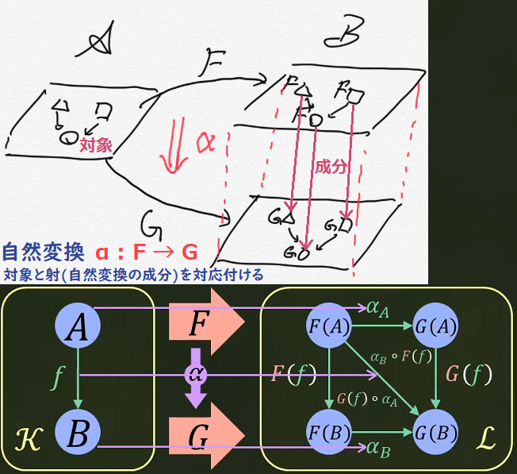

# Haskellまとめ

## サイト

## 構文

### 関数

- 関数とは、式に現れる変数に値を与える事によって式が具体的な値を表す仕組みです
**数学の関数**は`f(x) = x + 2`とか、`f(x,y) = x + y`とかで、
部分的にはHaskellも同じ仕組みをしています。
数学の分野の**ラムダ計算**は、カリー化もありこれも部分的にはHaskellも多分同じ仕組みをしています(計算行為上例外的な状況は多少ある..(ボトム(⊥)とか?))
詳しくは知らないが、Haskellは関数名もパターンマッチもカリー化もできるので、数学の関数とラムダ計算を足した感じ?

- 数学の関数とHaskellの関数とラムダ計算の比較
  - 数学の関数
  `f(x,y) = x + y`
  - Haskellの関数
  `f x y = x + y`
  - ラムダ計算
  `λxy.x + y`
  大体同じ

- Haskellの関数
```haskell
f :: Int -> Int -> Int -- 関数の型
f x y = x + y          -- 関数の定義
```
↓大体こんな感じです↓
`｢関数名｣ :: ｢引数1の型｣ -> ｢引数2の型｣ -> ｢式の型｣`
`｢関数名｣ ｢引数1｣ ｢引数2｣ = ｢式｣`

#### 式

- 式は関数の本体であり関数内の全ての処理がこの**一つの式に記述**されます。
`｢関数名｣ ｢引数..｣ = ｢式｣`
- 非関数型や数学の式と同じく式は、**必ず一つの値を返します**。
そこにいくつかの変数を引数として与えると、その与えられた引数に対応する値を返します。(式の中で**式の外の変数を参照しなければ**..)
  - なので、式は、**同じ引数に対しては必ず同じ値を返します**。これが**参照透過性**といわれています。

##### 優先順位

- 演算子には結合性と優先順位があります
  - **優先順位が高い演算子から評価**されていきます
  同じ優先順位の場合、結合性をみて、左結合だった場合は左から評価されます
  - 演算子の結合性と優先順位の設定は、`infix＠❰l¦r『結合性』❱ ❰0～9『優先順位』❱ ｢演算子("()"なし)｣` で定義します。(`❰l¦r❱`が無い場合は非結合。括弧`()`で囲む必要がある)
    - 関数は優先順位を設定(`infix`)できません
  - **関数は無条件で`infixl 10`です**。つまり、中置記法(`mod`など)にしたとき**一番優先順位が高く左結合**です
    - 中置記法にしない普通の関数の場合、関数の右に引数を並べるので、関数本体の式全体の左側(`=`のすぐ右)から関数が引数を取る数の分だけ取り評価しようとします
      - `f`が2引数,`g`が1引数,`a`と`b`が0引数を取る関数だとして、`f a g b`は`(f a g) b`と評価されてしまいますので、`f a (g b)`とする必要があります

- 演算子の優先順位

[](http://walk.northcol.org/haskell/operators/)

- 評価順序
1. 関数(fは関数)
`f 1 2 3` <=> `(((f 1) 2) 3)`(カリー化)
2. 演算子 (`infixl 6 +, infixl 7 *`)
`1 + 2 * 3` <=> `1 + (2 * 3)` <=> `(1 +) ((2 *) 3)` <=> `(+) 1 ((*) 2 3)` <=> `(((+) 1) (((*) 2) 3))`
3. 関数合成`(.)`と関数適用`($)`(`infixr 9 ., infixr 0 $`)(f,gは関数)
`f . g $ 1` <=> `(f . g) $ 1` <=> `(((f .) g) $) 1`
4. 同じ優先順位で結合性が互いに反対になるよう定義した演算子(`infixl 4 #<=#; a #<=# b = a + b;    infixr 4 #=>#; a #=># b = a * b;`)
`1 #<=# 2 #=># 4` => エラー, `1 #<=# (2 #=># 4)`(括弧`()`をして優先順位を明示すれば通る)

##### カリー化

- カリー化された関数とは、関数が必要とする**引数の数より少ない数の引数を渡す**と、残りの引数を必要とする**関数を返す関数**のことである(関数型ではこれが一般的)
  - 反対に関数が必要とする引数を同時に全て渡すのがアンカリー化された関数である(非関数型ではこれが一般的)
  - 圏論では`Uncurry : X × A -> B, Curry : X -> B^A (Xを与えるとHom(A,B)から射を一つ取り出す)`である

- C#版とHaskell版のカリー化を比べてみる
  - C#版
    ```csharp
    using System;
    public class M
    {
        public static void Main()
        {
            Console.WriteLine(Uncurrying(1,2,3));//=>5
            Console.WriteLine(Currying(1)(2)(3));//=>5
        }
        //アンカリー化        (Int,   Int,   Int)  ->  Int
        static int Uncurrying(int a, int b, int c) => a * b + c;
        //カリー化   Int -> (Int -> Int)           Int  ->   Int-> Int-> Int
        static Func<int, Func<int, int>> Currying(int a) => (b => (c => a * b + c));
    }
    ```
  - Haskell版
    ```haskell
    uncurryVal :: Int
    uncurryVal = uncurrying (1,2,3) -- => 5
    curryVal :: Int
    curryVal = currying 1 2 3 -- => 5

    uncurrying :: (Int, Int, Int) -> Int
    uncurrying (a, b, c) = a * b + c

    currying :: Int -> Int -> Int -> Int
    currying a b c = a * b + c
    ```
- ここで、引数を0個取る関数を作ってみます
  - C#版`int Five() => 5;`
  - Haskell版`five = 5`
  - Haskellでは、これ以外に`five`に`5`を関連付ける方法は無く、`=`は代入記号(コピー)ではなく
  数学の`=`と同じ意味の`five`は`5`であるという意味になります
  なので、`five`は引数を0個取る関数とも見えるし、`five`は`5`という値とも見え、
  Haskellでは**関数と値を区別しません**。なのでこれから**関数と言うとき引数が0個の関数も含める**場合があります

- Haskellの関数の式以外の記法
  - とりあえず、適当な関数を定義します
    - ```haskell
        func :: a -> b -> c -> ()
        func a b c  = () -- "()"は非関数型のnullのようなもの
        ```
    - そして`func`に一つづつ引数を与えて型を調べて行きます
    1. `:t func` => `func :: a -> b -> c -> ()`
    2. `:t func 1` => `func 1 :: b -> c -> ()`
    3. `:t func 1 2` => `func 1 2 :: c -> ()`
    4. `:t func 1 2 3` => `func 1 2 3 :: ()`
    つまり、関数に引数を与えるごとに以下のような関係があり、
    `((((func) 1) 2) 3)` <=> `(a -> (b -> (c -> (()))))`
    `a`を渡すと`b -> c -> ()`の関数を返す。`a b`を渡すと`c -> ()`の関数を返す
    よって、**どのくらい引数を与えるか**で**返される関数が決まります**
    なので非関数型と違って、引数を定義する順序は重要です
    それによって、他の関数の引数にできるかできないかが決まります(**合成可能性**)(まぁflip使えばできるけど)

##### 式の実態(ここでは引数0個の関数を値と呼んでいる)

- 式がどのように構成されて行くかを分解して観察してみる。以下の1.~10.は関数の`=`記号の右側 **(式)を表している**
小文字一文字のアルファベットまたは`(*)`は、0個以上の引数を取る**値または関数**で`❰f:2❱`という表記は`f`が2個の引数を取る関数とする。(`f :: a -> b -> c`)

1. 式は`a`という値を返す
    `a ❰a:0❱`
2. `f`が引数に`a`を取り値を返す
    `f a ❰f:1,a:0❱`
3. `f`が引数に`a`と`b`を取り値を返す
    `f a b ❰f:2,a:0,b:0❱`
4. `f`が引数に`a`を取り、もう一つ引数を取る関数を返す(カリー化の部分適用により関数が関数を返すこともある)
    `f a ❰f:2,a:0❱`
5. `(*)`が引数に`a`と`b`を取り値を返す
    `a * b ❰(*):2,a:0,b:0❱` => `(*) a b`
6. `(*)`が引数に`a`と`b`と`c`を取り値を返す(中置記法が2引数しか取らないとは限らない)
    `(a * b) c ❰(*):3,a:0,b:0,c:0❱` => `(*) a b c`
7. `g`が引数に`b`を取り値を返し、`f`が引数に`a`と`(g b)の返された値`を引数に取り値を返す
    `f a (g b) ❰f:2,g:1,a:0,b:0❱`
8. `g`が引数に`a`を取り、もう一つ引数を取る関数を返し、`f`が引数に`(g b)の返された関数`を引数に取り値を返す
    `f (g a) ❰f:1,g:2,a:0❱`
9. 内部の`(an1 an2..ann)`が値または関数を返し外部の`(b11..b1n)`が内部の`(an1 an2..ann)`を引数に取り値または関数をまた外部に返す
    `(..(b11..(a11 a12..a1n)..(a21 a22..a2n)..b1n..)..) ❰ann:0個から任意個の引数を取る❱`
10. `9.`をランダムに再帰的に拡張すると以下の様になり式というのは本当に**数学の数式と構造が同じ**である(ラムダ式、if,case式は関数の`=`の左側に追いやることができる。where,letは展開できる)
    `..(..(..)..(..(..)..(..)..)..(..(..)..(..)..(..(..)..(..)..(..)..)..(..)(..)..)..).. ❰..:関数または値、の列(0個から任意個の引数を取る関数の列)❱`
    つまり、式は、**関数と括弧**で構成するように書き直すことができる。
    当然そこには、他の非関数型言語で行う状態を保存したり取り出したりする**代入記号`=`は現れない(純粋関数型は状態を一切持たない(デフォルトスレッドセーフ?))**
    したがって、関数型の`=`は**何であるか**であり、非関数型の`=`は**何をするか**、である

- 合成a->b、適用a、

#### ラムダ式

#### マッチ

- マッチは、値を変数に束縛する時、`=`の左側の構文によって値をどの様に束縛するかを決めます

1. **値**を束縛
`a = 1` => `a = 1`
`a = Just 1` => `a = Just 1`
2. **値引数**を束縛
`Just a = Just 1` => `a = 1`
3. **値引数の値引数**を束縛 (オブジェクト指向で例えると`a = Just.Just.1`?)
`Just (Just a) = Just (Just 1)` => `a = 1`
`[a,b,c] = [1,2,3]` => `a = 1, b = 2, c = 3`
4. **複数の値引数**を束縛
`(a,b,c) = (1,2,3)` => `a = 1, b = 2, c = 3`
5. **ワイルドカード`_`**への束縛
`_ = 1` => なし
`(a,_,c) = (1,2,3)` => `a = 1, c = 3`
6. asパターン`@`への束縛
`all@(a,b,c) = (1,2,3)` => `all = (1,2,3)`

#### パターンマッチ

- パターンマッチは、関数に渡さっる値により評価する式を変えることによって**処理を分岐**します。(必ず値を返すswitch文に近い構文です)
  - パターンマッチは**上からマッチ**するか判定し、`マッチされる値(変数付き) == 渡される値`が`True`になればそれに**対応する式が評価**されます。
- この**パターンマッチとガード**でHaskellは全ての分岐を表現できます(非関数型の三項演算子`?:`に非常に近い)
- パターンマッチは**引数に対する結果の対応付け**であり、**原始的な演算**と見ることもできる?
  - もっと厳密にいうと、直和型の値で場合分けする?

1. **具体型の値**によるパターンマッチ
    ```haskell
    f1 :: Bool -> ()
    f1 True = ()
    f1 False = ()
    ```
2. **文脈の値**によるパターンマッチ
    ```haskell
    f2 :: Maybe a -> ()
    f2 (Just a) = ()
    f2 Nothing = ()
    ```
3. **文脈の文脈の値**によるパターンマッチ
    ```haskell
    f3 :: Maybe (Maybe a) -> ()
    f3 (Just (Just a)) = ()
    f3 (Just Nothing) = ()
    f3 Nothing = ()
    ```
4. **型**によるパターマッチはできない
    ```haskell
    f4 :: a -> Int
    f4 a = 1
    -- f4 True = 2  -- "a"を特定の型にすることはできない
    -- f4 "abc" = 3
    ```
5. **型クラス内の型**によるパターンマッチはできない
    ```haskell
    f5 :: Show a => a -> String
    f5 a = show a
    -- f5 True = show True  -- "Show a"を特定の型にすることはできない
    -- f5 "abc" = show "abc"
    ```

#### [ガード](http://walk.northcol.org/haskell/expressions/#_%E3%82%AC%E3%83%BC%E3%83%89case_%E5%BC%8F)

- ガードはパターンマッチに成功した時に**束縛された変数**をBoolを返す関数に渡し、**上からTrue**になった行に**対応する式を評価**します
  - パターンマッチと比較すると、変数に**束縛しない**、`==`だけでなく**任意のBoolを返す関数**を使える
  - `g |True = ()` <=> `g | otherwise = ()` => `otherwise == True -- => True`

#### 主要な関数

```haskell
-- 恒等関数(恒等射)
id x = x

-- 関数適用
infixr 0 $
($) :: (a -> b) -> a -> b
f $ a = f a

-- カリー,アンカリー化
curry f (a,b) = f a b
uncurry f a b = f (a,b)

-- 関数合成(射の合成)
(.) :: (b -> c) -> (a -> b) -> (a -> c)
f . g = \x -> f (g x)

-- Functor(射の関手)
fmap :: (a -> b) -> f a -> f b
-- (Maybeの実装の場合)
fmap f Nothing = Nothing
fmap f (Just) a = Just (f a)
-- (リストの実装の場合)
fmap = map -- (map f [] = []; map f (x:xs) = f x : map f xs)

-- Applicative
pure :: a -> f a
(<*>) :: f (a -> b) -> f a -> f b
-- (Maybeの実装の場合)
pure a = Just a
Nothing <*> _ = Nothing
Just f <*> a = fmap f a
-- (リストの実装の場合)
pure a = [a]
[] <*> _ = []       -- fs,xsなど二重ループしたかったら二重再帰ループか?(fs<*>とfmap xs)
(f:fs) <*> xs = fmap f xs ++ (fs <*> xs)

-- Monad (クライスリトリプル)
return :: a -> m a
(>>=) :: m a -> (a -> m b) -> m b -- m a -> m b で"m"==モナドに閉じ込めている。その過程で">>="が"m a"の中身の"a"を取り出し"a -> m b"(ユーザー定義関数)を実行
-- (Maybeの実装の場合)
return a = Just a
Nothing >>= _ = Nothing
Just a >>= f = f a
-- (リストの実装の場合)
return x = [x]
xs >>= f = concat (map f xs) -- "join . fmap ｢クライスリ射｣" の形 ("join . fmap"は、"a -> m b" を "m a -> m b" にする(joinはμ))
-- (Stateの実装の場合)
newtype State s a = State {runState :: s -> (a, s)}
return x = State $ \s -> (x, s)                -- ↓"h"の中に"s -> (a, newState)"が畳み込まれている?-- \s2 -> f2 ((\s -> f (h s)) s2) <=> f2 . f . h 関数合成に似ている
State h >>= f = State $ \s -> let (a, newState) = h s in runState (f a) newState
-- Stateモナドはカリー化の随伴から作る。F(x) = X × S(アンカリー), G(Y) = Y^S(カリー), T(A) = G ○ F(A) = G(A × S) = (A × S)^S, s -> (a, s)

-- モノイド
mappend :: m -> m -> m -- m a -> m b -> m cにはなっていない、モノイドはモノイドの中身まで言及していない
mempty :: m
mconcat :: [m] -> m -- モノイドの畳み込み
mconcat = foldr mappend mempty
-- (Sumの実装の場合)
mempty = Sum 0
Sum a `mappend` Sum b = Sum $ a + b
-- foldMap(モノイドにマップして畳み込み)
foldMap :: Monoid m => (a -> m) -> [a] -> m
foldMap f xs = mconcat $ map f xs
```

### 代数的データ型

- データ型は、Haskellの全ての型とその値を定義します。(値そのものを定義できます)
- 型ですがC#のような関数もフィールドも持ちません。**定義しているのは値**です。int型やEnumを定義しているような感じです
  - C#で直和型は作れませんが共用体(Union型)で作れそう(先頭アドレスにEnumを仕込み今なんの値か判定する)
- 値コンストラクタはC#と比較して`new Struct(1,2,3) == Struct 1 2 3`のようなものですが、`Struct`は型ではなく値を作る関数です
- 型は圏論でいう対象にあたります
  - 型コンストラクタは対象の関手にあたります(射の関手はfmap)

1. 最もシンプルなデータ型
    - 型名と値名は大文字から始まります
    `data Type1 = A`
    - 値コンストラクタ名が型名と同じでもいい
    `data Type2 = Type2`
2. 値コンストラクタが複数のデータ型
   - 直和型によって、C#のEnumのように値を判別することができます
   `data Type3 = A | B | C`
3. 値コンストラクタが値引数を取るデータ型
    - `data Type4 = A Int`
4. 型コンストラクタが型引数を取るデータ型
    - 型引数はC#のジェネリックの型引数のようなものです
    型引数は小文字から始まります
    `data Type5 a b = A a b`
    再帰的なデータ型
    `data Type6 = A Type5 | Nil`

#### 主要なデータ型

### [型クラス](http://walk.northcol.org/haskell/type-classes/)


- 型クラスとは、ある型の集合が利用する同じ型の構造を持つ関数(または定数)を定義します
  - つまり、**型の集まりについて関数を定義**します
- C#のインターフェースとその実装に似ています
- {class=> m = f2 f1 a <=instance} : m    //**複数の文脈**(と型)が**一つの型**として表すこともある
  {class=> m = f2 f1 <=instance}   : m a  //**型クラスが文脈**になり、**型引数を要求**することもある

```haskell
-- "Interface"がこの型クラスの名前になり、"i"にある型の集合が入ります
-- "Show i =>" は関数の型制約と同じく、"i"が"Show"型クラスのinstanceであることを要求します(C#の型制約(where)に似ています)
    -- これにより、"i"は"Show"型クラスが定義する関数を利用できます。
    -- この関係を継承関係と見ることもできるし、"Interface" ⊂ "Show"("Interface"は"Show"の部分集合である)と見ることもできます
class Show i => Interface i where
    value :: i
    -- strval :: String  -- "i"に関係のない関数は書けません(型に"i"が必ず現れる必要がある(多分))
    odoroki :: i -> String
    odoroki a = show a ++ "!!" --デフォルト定義。C#のデフォルト定義と同じ
    ifunc :: i -> i -> String

class Wrapper w where
    wrapper :: a -> w a  -- 型クラス変数"w"は、具体型でなく文脈(抽象型)としても定義できます。(w = Maybe a ではなく w = Maybe のような感じです)

-- Interface i => Interface Int に変え"i"に具体的な型を与えます(i = Int)
-- Int ∈ Interface と見ることもできます(値(1,2,3..) ∈ Int ∈ Interface ⊂ Show みたいな(Haskellの型のベン図が書けそう))
-- classで定義した関数をオーバーライドします
instance Interface Int where
    -- value :: Int     -- "i"に"Int"を適用しますので、classで定義した"i"が"Int"に置き換わった型になりますが、明示するとエラーになります
    value = 496
    -- ifunc :: Int -> Int -> String
    ifunc a b = show a ++ "," ++ show b

-- 使用
va = value :: Int -- => 496
od = odoroki (124 :: Int) -- => "124!!"
ic = ifunc (123 :: Int) (456 :: Int) -- => "123,456"

-- C#との比較: https://sharplab.io/#v2:C4LgTgrgdgNAJiA1AHwAICYCMBYAUHvDAAgCUiQiBhAewBtqwBvAXyOIHFyq6GW30iAIS416TVgHoJcAIbAZ3MUQC8pIsiKcNgvET36Dho8ZOnTUgBSUAxIGsGQPYMgF7dAMSqBo9UAyDIEJHQCIMgOwZA5gyAuwyAVwyARwyAPwyAqwyAxQyAXQyABwz+gBYRgH/OAJR4AJZQwACmYABmMgDGuUQAogCOAPoAPDIAfERSxFUA5EQKAO4AFvm5eIy6+gBG1HREuVMWCgAeMAoAnmkqTQCEubS5FvPLANxSsyrKqosqRFDUwEQAJERHyhKnw3pjE5vbcwtEy6tEG9NdmkDhIHk8fudLtc7g8ThCpIAAc0A8DqAGO1ABaKgCztQCV/nhmIQBKIGFwqnVCWAmlJsgBneRQUoVSodMlEXr9QYvNgAZiIb1ok2mzPmiiJv2UDQ5BlmADp2LlgAAVRYAB22KzhwGVuWoBQsJBWADJ9T8ZXLFSqLGrVBqVdrdWkAPxEYCQMogKRkE6qD1EeUuiX6aWyhWai3HJ2a23sA1GxYm4Pmy3hm06qOO50QV1STiezTnX0Z/16QOmkOJ61anWCaPGoNm1Vh8u2qtpl3kKTCHMdn1+3ASABUZhMgETCAyARYZAP0M4UAzwyAPYZAMMMgEGGQcj0x9iRFWhU3Ig6rHVS71QAMRkm4GuDx+FwxAAskNcAZUJgAGxsAAsRGvMmyFo5d5MADcZDAIhij0VQoFyLphTAC09kLIhAOA4DwMg0hYPgxCiAAc0hVD2HQ+9jEwkZcKgwQCJMeDHwATgsAAiXl+U+e5vmWOjgSozBaIsCwSVqMkGjSYo0ilKZtjAGAwDSYEpDFfMymaCRigABnOD04TIABaTTVnkzjuN4mp+J4ckhJEsSLAkrDpJBMVj1PRTikwNS91zbTVnsrd9J4wzSRMwThNE6YsJgEYbNkhpPLKKRigEVRszhYR3Lsk8vMIowaPoxiPhmFiljSdi4PSwxMp4viBLM0StksyTwqeSLUuipTuS9FRwS0nSUtPbyyqMirApyqy6rk1tHPfVrHniohkoaPTiofLifPK/zKpykKwpk+r5L0GKAFZzmzcEks62aewMC8LyAA===
data Color = R | G | B_

-- class    Eq' a     where
--              ↓  C#では、class Color : Eq'<Color> のようなinterface実装
-- instance Eq' Color where

class Eq' a where
    -- fail :: Int -> Int -- 引数に"a"を含めなければ実際に使われる時、型推論できない
    (===) :: a -> a -> Bool
    (=/=) :: a -> a -> Bool
    x === y = not $ x =/= y -- C#interfaceのデフォルト実装のような(Haskellでもデフォルト実装とよぶ)
    x =/= y = not $ x === y

-- fmapはC#でList<int>を引数にList<string>を返すような => interface Functor<f> {f<b> fmap<a,b>(Func<a,b> Arrow_ab, f<a> f_a);}
                                                                    -- //CS0307: 型パラメーター「f」は型引数と一緒に使用できません //文脈には関数を定義できない
-- instance Functor Maybe where -- :k Maybe => Maybe :: * -> *, :k Functor => (* -> *) -> Constraint
    -- fmap :: (a -> b) -> f a -> f b -- f a, f b のように、aを型引数に取っていてMaybeは型引数を一つ取るのでカインド(種類)が合う
-- instance (Eq m) => Eq (Maybe m) where --Maybe Int とか具体型を書かなくても、型引数?多相型?を使える。(Eq m) => はC#では、where m : Eqでジェネリックの型制約の様な
instance Eq' Color where
    R === R = True      -- "==="は上のclassの"==="をオーバーライドして実装している
    G === G = True
    B_ === B_ = True
    _ === _ = False

c0 :: Bool
c0 = R === R -- =>True
c1 :: Bool
c1 = R === G -- =>False
c2 :: Bool
c2 = G === B_ -- =>False

c3 :: Bool
c3 = R =/= R -- =>False
c4 :: Bool
c4 = R =/= G -- =>True
c5 :: Bool
c5 = G =/= B_ -- =>True
```

## その他考察

## 純粋関数型と非関数型(C#)


- delegate(Func<>)による高階関数、Stateモナドによる状態管理
- 抽象化のオーバーヘッドを喰らう可能性
- 関手と自然変換
  - 対象: 型(Func<T>は指数対象)
  - 射: 関数(純粋な)(純粋関数と呼ぶ?)(参照不可能な出力は許す?WriteLine()とか)
  - 関手
    - 対象(型): 型構築子はジェネリック([]関手 <=> List<T>関手)、
    - 射(関数): 非関数型のfmap、型(クラス)毎にFunctor<B>を定義するしかない?`interface Functor<f> {f<b> fmap<a,b>(Func<a,b> Arrow_ab, f<a> f_a);} //CS0307: 型パラメーター「f」は型引数と一緒に使用できません //文脈には関数を定義できない`
  - 自然変換: 型->Nullable型、型->List型、などの型を内包するジェネリックなコンストラクタ
    - List<T>.ToArray(Listから配列への自然変換(コピー))、ToString()(型->String型(ただし、情報を保存していない場合は違う))
    - リファクタリングとは、プログラムの**挙動からコードへの対応を関手**として、その挙動を変えずにコードを良くする行為は、**悪いコード**から**良いコード**への**自然変換**である
  - 直積、直和
    - 直積: フィールドメンバ変数、引数はデフォルトで直積(アンカリー)
    - 直和: Union型?、ポリモーフィズム、型の値を直和と見る
      - ifなどの分岐は、直和の場合分け
- 関数型とオブジェクト指向の違い
  - OOPはクラスがモジュール、関数型は関数の階層

## 圏論とHaskell

- 圏論とは、なんらかの**2つの対象**/オブジェクトに何らかの**繋がり**があり、**その繋がりが2つ**あるときその関係性が、**単位律、推移律、結合律**、を満たすとき、**その繋がりを射**と呼び、その**射の集まりを圏**と呼び、
その射の繋がり方、**射の性質**、圏の構造、圏と圏の関係を議論するのが圏論である(で、い、いいかな?..)

- 圏とは、射と射の繋がり方が**ある法則を満たしている空間**である
  - その法則とは、集合論の写像、順序関係の`<=`、SNSのフォロー関係、など、そこに**矢印的な何かの集まり**が、単位律、推移律、結合律、を満たせばその集まりを圏として定義できます

- そして、純粋関数型言語の圏とは**型と関数**からなる圏であり、対象が型、射が関数、となります。その中でもHaskellの圏はHask圏と呼ばれているみたいです

- [Hask圏](https://scrapbox.io/mrsekut-p/%E5%9C%8F%E8%AB%96%E3%81%A8%E3%83%97%E3%83%AD%E3%82%B0%E3%83%A9%E3%83%9F%E3%83%B3%E3%82%B0)(あんまり見れていない)
  - 圏の要素など
    - 対象: 具体型 
      - >射の集合`(->) A B`、つまりHask(A,B)(Hom(A,B)ではなくHask圏の**指数対象B^A**?)も対象になる
        - C#では`Func<>デリゲート`?(Func == 関数型)
    - 射: 任意の関数
    - 合成: 関数合成`(.)`
    - 恒等射: id
    - 関手
      - **対象: 型コンストラクタ**
      - 射: Functorの`fmap`
        - `Functor ((->) r)`はドメインを`r`に固定したHom関手[Hom関手と関数型(->)](https://scrapbox.io/mrsekut-p/Hom%E9%96%A2%E6%89%8B%E3%81%A8%E9%96%A2%E6%95%B0%E5%9E%8B(-%3E))
    - 自然変換: 型が`m a`となっている時、関数が文脈(`m`)だけに依存する関数 (対象を関手先の対象から関手先の対象への射に対応付ける。その射を全て集めたものが自然変換)[自然変換](https://youtu.be/IpvhsTpsULk?t=192)
      - 型コンストラクタから型コンストラクタへ変換する関数かな?(つまり、文脈だけを変換する関数)(`length: [a] -> Int`の様に`[]->Int`(文脈->具体型)に変換するのもある)
      - `nat :: (Functor f, Functor g) => f a -> g a`
      - [Hask圏における自然変換](https://scrapbox.io/mrsekut-p/Hask%E5%9C%8F%E3%81%AB%E3%81%8A%E3%81%91%E3%82%8B%E8%87%AA%E7%84%B6%E5%A4%89%E6%8F%9B)
        - ↑`eta2 n = [n*10]`は自然変換ではないと思う。`*`の演算が`n`がNum型クラスに属している型である事を要求している。[自然性とは](https://youtu.be/E8vr8j5uyII?list=PLzJWjr7AvxH37O6GPqx20NpF0HaSrndVc&t=2391)
      - 自然変換の図 [自然変換と合成](https://youtu.be/IpvhsTpsULk?t=109), [自然変換](https://scrapbox.io/mrsekut-p/%E8%87%AA%E7%84%B6%E5%A4%89%E6%8F%9B)
      
    - 終対象: ユニット型`()`と同型な型全て
    - 始対象: 値が一つも無い型?!
    - 直積への射を作る関数: `(&&&)`
    - 直和への射を作る関数: `(|||)`
    - モナドのクライスリトリプル: `m,(>>=),return`
  - Hask圏が圏の条件を満たすか
    - 単位律: `id . f <=> f`, `f . id <=> f`
    - 推移律: `f :: a -> b`, `g :: b -> c` のような射が存在する時必ず `g . f` ができる
    - 結合律: `h . (g . f)` <=> `(h . g) . f`
  - デカルト閉圏
    - Hask圏はデカルト閉圏(分配的)になります
    - 指数対象: カリー化 `a -> b -> c` <=> `a -> c^b`, `a -> b` <=> `b^a`(としてもいい?)
    - 積: タプル `(a,b)` <=> `a×b` <=> `ab`?
    - 余積: 直和型 `a | b` <=> `a+b`
      - これにより、指数法則を使った変換ができる([{Hom(X, Y^(B×A)) <=> Hom(X, Y^B^A)} <=> {Y^(B×A) <=> Y^B^A}]米田の原理)
      - `c->(a,b)`: `(ab)^c` = `(a^c)×(b^c)` :`(c->a, c->b)`
      - `(b|c)->a`: `a^(b+c)` = `(a^b)×(a^c)` :`(b->a,c->a)`
      - `(b,a)->c`: `c^ba` = `(c^b)^a` :`a->b->c` (カリー化)
  - Curry-Haward-Lambek対応
    良く分からんけど、**型と関数**からなる圏と**論理**の圏が**対応**(関手がある?)するという話
    - 射`a->b`: a ⇒ b (ならば)
    - 積`(a,b)`: a ∧ b (論理積)
    - 余積`a|b`: a ∨ b (論理和)
      - に対応し、例えば、定義:`fd (Just (a, b)) = Just a`型:`Maybe (a,b) -> Maybe a` <=>
        `(a,b)|c -> a|c`(c == Nothing) <=> `(a∧b)∨c ⇒ a∨c`は証明できるからコードが書けるとか言うやつ(coq(定理証明支援系)とかあったような)
  - haskellにおける圏論の関心事?
    - 関数合成`(.)`や関数適用によって関数の出力の**型をどう変化**させ、それらを**どう合成**するか?(合成可能性)
    - 自然変換という、**内部の型に依存しない射**をどう作るか?(モナドのμ(join)とη(return)など)
    - システムに適した**代数的データ型**(`data`)をどう作るか?

- Control.Category(圏論?), Control.Arrow(&&&とか)

## コンパイラ

### GHC

### GHCi

- ====== =<<,タプル,リスト,GHCi,GHC,ラムダ式,オーバーロード不可?,型引数,値引数,関数引数,型と値は大文字,
- プログラム運算,error関数
- ,直和型(Union型,intもUnionと見ることもできる),非関数型は状態を持つ
- ノードベースプログラミングは関数型
