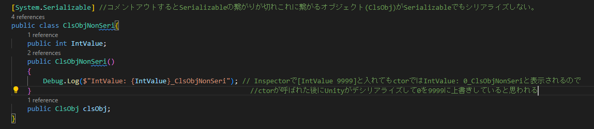

# SerializedObjectとISerializationCallbackReceiver

## SerializedObject `[UnityEditor]`

### 概要

- SerializedObjectは、**C++Object内のシリアライズデータ**を**C#のSerializedObject型**にコピーして編集し、またC++Objectへコピーできる様な型で、
  C++Object内のシリアライザを**C#の参照型で編集**するための機能です
- **Editor拡張**は**SerializedObject**を通して**UnityObjectを編集**します

### メソッド

- `new SerializedObject(｢UnityObject｣)`
  - コンストラクタで**UnityObject**から**SerializedObject**を生成します。
  これによって、UnityObjectの対の**C++Object内**から**シリアライズデータ**を**コピー**し**SerializedObject型**として格納します。
  - SerializedObjectはUnityEngine.Object **(UnityObject)を継承しません**。そしてコンストラクタで生成しているという事から、
  SerializedObjectは**Unity**のシステム内で**管理されず**、**C#スクリプト内のみ**存在すると思われます。
- `FindProperty("｢Inspectorのプロパティ名｣")`
  - このメソッドによって**SerializeObjectを編集**します。プロパティ名は**文字列で指定**します(データの塊から参照なので文字列以外指定しようがないか(多分、辞書みたいになってる))
  - このメソッドは**SerializedProperty型**を返しそこから、**｢型｣Valueプロパティ**を通して｢型｣への編集をします。(例:`FindProperty("｢Inspectorのプロパティ名｣").stringValue`)
    - 多分内部で、`*(T*)propertyPtr`の様な型への変換をしている。ジェネリック版はでないのか`FindProperty<T>("｢Inspectorのプロパティ名｣")`
- `Update()`
  - このメソッドにより、**C++Object内のシリアライズデータ**を**C#のSerializedObject**へコピーします
- `ApplyModifiedProperties()`
  - このメソッドにより、**C#のSerializedObject**を**C++Object内のシリアライズデータ**へコピーします

## シリアライズ可能な型

- UnityObject
- [System.Serializable]がついたクラス、構造体
- int,float,string,..などC#のプリミティブ型
- [SerializeReference]を付けると派生クラスは基底クラスに暗黙アップキャストされず派生クラスとしてシリアライズできる(確か)
  - 互換性を保つためダセェけど付けないといけない(確か)(基底クラスに暗黙アップキャストされるかされないかで挙動が変わる可能性がある)
- 
- [SerializeField]は`private`でもシリアライズ可能にする
- [System.NonSerialized]がついたフィールドメンバ変数はシリアライズを不能にする

## ISerializationCallbackReceiver

### 概要

- ISerializationCallbackReceiverは**MonoBehaviourに実装**する**シリアライズの直前**と**デシリアライズの直後**に呼ばれる**コールバック**を定義する為のInterfaceである
- **UnityObject**のフィールドにある **｢シリアライズ不能な型｣**を**シリアライズ,デシリアライズする為**にシリアライズの直前とデシリアライズの直後に呼ばれる**コールバックを使い**
**シリアライズの直前**: ｢シリアライズ不能な型｣ => ｢シリアライズ可能な型｣, **デシリアライズの直後**: ｢シリアライズ可能な型｣ => ｢シリアライズ不能な型｣
というよう変換を差し込みます
- このコールバックを使うことで**シリアライズ,デシリアライズ**の**タイミングを知る**ことができる
- その結果、
  - Unityは**UnityObject**が**Inspectorに表示**(**Inspector**はUnityObjectのC++Objectにある**シリアライズデータ**をプロパティとして**表示**します(追記: 正確には
    さらに、そのシリアライズデータをInspectorを表示している**SerializedObjectへUpdate関数で更新**していると思う。Update関数の中でシリアライズを実行しているかもしれない))
    されている間、`OnBeforeSerialize()`を**呼び続け**、
    **UnityObjectのシリアライズ可能な変数**から**C++Objectのシリアライズデータ**を更新し続け、Inspectorに表示されているUnityObjectの**最新のプロパティの状態を表示**します
    - Inspectorを表示せず**UnityObjectのシリアライズ可能な変数**のみをスクリプトなどで**変更**しても`OnBeforeSerialize()`は呼ばれないので、
    **UnityObjectの変更**を**常に**シリアライズしC++Objectへ**更新している訳ではない**
  - Editor操作によるInspectorの**プロパティへの書き込み**があった場合`OnAfterDeserialize()`がよばれ、**C++Objectのシリアライズデータ**が**UnityObjectのシリアライズ可能な変数**へ
    更新されます

### コールバック

- `public void OnBeforeSerialize()` Interfaceの実装なので**public**が必要
  - **シリアライズの直前**に呼ばれます。詳細は概要
- `public void OnAfterDeserialize()` Interfaceの実装なので**public**が必要
  - **デシリアライズの直後**に呼ばれます。詳細は概要
