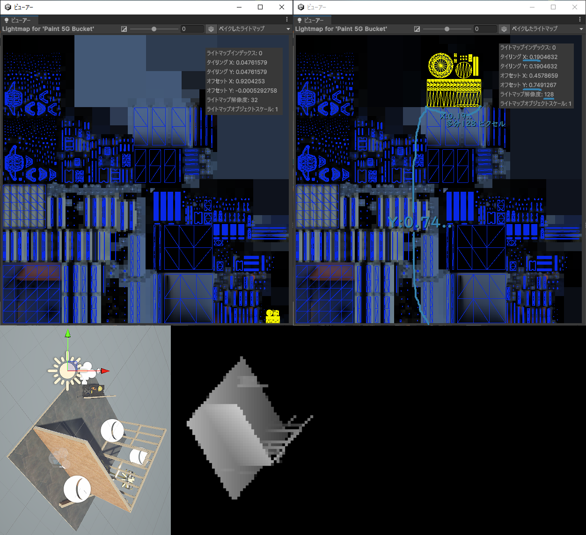

# Renderer と MeshRenderer

## Renderer (Component継承)

主に、**描画順序**(`SortingCriteria`), **renderingLayerMask**, `⟪｡localToWorld｡⟫Matrix`, **Material**, isVisible, レンダリング方法に関する設定

### Instance変数

#### 有効化と描画順序とrenderingLayerMask

- **有効化**
  - `bool enabled`: 単にこの`Renderer`の**有効無効**? (>有効にした場合、レンダリングされた 3D オブジェクトが表示されます)
  - `bool forceRenderingOff`: >特定のコンポーネントのレンダリングをオフにすることができます。?
- **描画順序** (`SortingCriteria`)
  - メモ
    >**SortingGroupComponent**は、`GameObject`を**SpritRenderer**と一緒にグループ化し、その中でSpriteを描画する順序を制御できます。
      1つの`GameObject`であるかのように、同じSortingGroup内のSpritRendererを一緒に描画します。
  - **SortingLayer**: `enum SortingCriteria.SortingLayer`
    [Sorting Layer ＞ Order In Layer❰sortingOrder❱ ＞ Z値](https://tsubakit1.hateblo.jp/entry/2016/12/28/231836)<https://qiita.com/lycoris102/items/b620654192af4f695fb4>
    [`static SortingLayer[] SortingLayer.layers`](https://docs.unity3d.com/ja/2023.2/ScriptReference/SortingLayer.html)
    :⟪デフォルト¦存在しない*Name*⟫は、*Name*:`Default`,*ID*:`0` となる。`SortingLayer.layers`を設定する度に*ID*が**乱数**で設定される。
    - `int sortingLayerID`: `sortingLayerName`の**識別ID**
    - `string sortingLayerName`: `ProjectSettings/Tags and Layers/Sorting Layers`にある*Name*を設定する
  - **sortingOrder** `enum SortingCriteria.CanvasOrder`
    - `int sortingOrder`: *SortingLayer*内の描画順 (*Layer*が`オブジェクト`で*Order*が`オブジェクトのパーツ`のような) (デフォルト`0`、負の数ok)
  - `int` **rendererPriority**: `enum SortingCriteria.RendererPriority` (デフォルト`0`、負の数ok)
- `uint` **renderingLayerMask**:
  - `context.DrawRenderers(..)`に渡す`struct FilteringSettings`との**論理積**で**描画**。(名前は`ProjectSettings/タグとレイヤー`で設定)
  - **Rendering Layers**にも関係がある。シェーダー内で影響を `与える側(Light,Decal,Shadow)`と`受ける側(Renderer)`の**論理積**で**描画** (こっちがメインの機能?)

#### Rendererの基本要素

- **可視性**
  - `bool isVisible`: このRendererが**何らかのPass**で**描画**されると`true`になる。と思われる
- **静的バッチ**
  - `bool isPartOfStaticBatch`: この`Renderer`が他の`Renderer`と**Meshの静的バッチ**を**共有**しているかどうか?
- **オブジェクト基本情報**
  - `⟪｡localToWorld｡⟫Matrix`:
    - >⟪｡Local座標からWorld座標｡⟫へ変換した`Matrix`。(Read-Only) (**静的バッチ**による**頂点位置変更**を**考慮**)
    - このMatrixは、Shaderの`cbuffer UnityPerDraw{ float4x4 unity_⟪｡ObjectToWorld｡⟫ }`と同じ?
      - `Transform.⟪｡localToWorld｡⟫Matrix`は**静的バッチ**による**頂点位置変更**を**考慮していない**
  - `Bounds ＠❰local❱Bounds`:
    - **⟪Local¦World⟫空間**の**バウンディングボックス**(AABB)(多分、静的バッチ後のAABBではない)
    - **独自のバウンディングボックス**を**設定**することもできるが、`Transform`による**自動更新をしなくなる**
      - **独自設定**を**解除**するには`Reset＠❰Local❱Bounds()`を呼ぶ
  - `Transform probeAnchor`: 設定すると**その位置**で`LightProbe`や`ReflectionProbe`を見つける。(**デフォルト(null?)**は`↑のbounds.center`?)
- **Material**
  - `Material＠❰[]❱ ＠❰shared❱Material＠❰s❱`  [↓renderer.material.get](images\renderer_material_get.png)
    - `✖❰shared❱`は、`Renderer`が参照している`Material`を**クローン**(シャローコピー?)して返す。(`Material`への変更は**独立**)
      - 正確には`this.＠❰shared❱Material = new Material(this.sharedMaterial)`つまり、**クローン**した`Material`を`this`(**自分自身**)に**Set**しそれを**返している(Get)**
        - そして、`new Material(..)`による**クローン**(`UnityObject.Instantiate(obj)`とは処理が違う?)は **＠❰Set後❱最初の1回**しか行われない。(2回目以降は`❰shared❱`と挙動が同じ?)
      - そうなっているのは、元々`Material`を`Asset`として**複数**の`Renderer`と**共有されている状態**から**クローンして分離**し`Material`への**変更を独立**させるためと思われる
        - **挙動が複雑**なので`sharedMaterial＠❰s❱`と`new Material(..)`のみを使うのもありかも(<https://qiita.com/nigiri/items/19bc9af74d81e91935d4>)
    - `❰shared❱`は、`Renderer`が参照している`Material`をそのまま返す。(`Material`への変更は**共有**)
    - `✖❰shared❱`と`❰shared❱`で、`Set{..}アクセッサ`は同じなので**Set方向は同じ** (**独立**に⟪*guid*¦C#参照?⟫で`material`に参照) (`material＠❰s❱.get`以外は**正常動作**と思われる)
    - `✖❰s❱`は、`サブMesh`があり**複数**の`Material`がある場合、**最初**の`Material`のみ返すと思われる
    - `❰s❱`は、**全て**の`Material`を配列で返す

#### レンダリング方法に関する設定

- **Shadow** (Material(Shader)固有の設定をなぜRendererで設定しているのか理解に苦しむ)
  - **Cast**
    - `ShadowCastingMode shadowCastingMode`:
      - Shadowを**ShadowMapに描画**する方法と、**自身の描画**について設定する
      - `enum ShadowCastingMode`
        - `Off`: `Tags{ "LightMode"="ShadowCaster" }`のPassは**実行されない**?
        - `On`: `Tags{ "LightMode"="ShadowCaster" }`のPassは**実行される**?
        - `TwoSided`: `Tags{ "LightMode"="ShadowCaster" }`のPassを**実行**し**BackFaceカリングをしない**?
        - `ShadowsOnly`:  `Tags{ "LightMode"="ShadowCaster" }`のPassを**実行**し`Tags{ "LightMode"="UniversalForwardなど(ライティング系)" }`は**実行されない**?
    - `bool staticShadowCaster`:
      - この`Renderer`の`staticShadowCaster`の設定。`true`にすると(Shadow描画のために静的であるとみなされ)`ShadowMap`の**事前ベイク**をする?
        - >このレンダラーはスタティックシャドウキャスターですか？。有効にすると、Unityはこのレンダラーをシャドウレンダリングのために静的であるとみなします。
          >SRP がキャッシュされたシャドウ マップを実装している場合、このフィールドは、どのレンダラーが静的とみなされ、どのレンダラーが動的とみなされるかをレンダー パイプラインに示します。
  - **Receive**
    - `bool receiveShadows`:
      - この`Renderer`が`Shadow`を`Receive`するかどうか。(`⟪MAIN¦ADDITIONAL⟫_LIGHT_CALCULATE_SHADOW`を **#define**するかどうか?。`URPAsset/Cast Shadows`との**論理積**?)
- **ReflectionProve**
  - `ReflectionProbeUsage reflectionProbeUsage`:
    - >反射プローブはこのレンダラーのために使用する必要があるか。
    - `enum ReflectionProbeUsage`
      - `Off`: >`ReflectionProbe`は無効になり、**常に**`SkyBox`が使われる
      - `BlendProbes`: 近くにある**2つ**の`ReflectionProbe`間で**補間**し、`ReflectionProbe`が1つも無いとき、`SkyBox`が使われる? (屋内)
      - `BlendProbesAndSkybox`: 近くにある2つの`ReflectionProbe`と`SkyBox`の**3つで補間**される? (屋外)
      - `Simple`: `ReflectionProbe`間で**補間せず**、`ReflectionProbe`が1つも無いとき、`SkyBox`が使われる
- **Light⟪map¦Probe⟫**
  - **LightMap** 
    - `int ＠❰realtime❱lightmapIndex`:
      - `static LightmapData[] LightmapSettings.lightmaps`を**参照**するための`lightmapIndex`
        (0xFFFF(-1?): `LightmapData`**割当なし**。0xFFFE: `ライトマップのスケール`が0で**割当なし**だが、**他のオブジェクト**には**GIの影響を与える**)
      - `LightmapData`
        - `Texture2D lightmapColor`: >`入射光の色`を保存するライトマップ。(`lightmapDir`が無い場合は`dot(Normal,LightDir) * 入射光の色`が入っている?)
        - `Texture2D lightmapDir`: >入射光の主な`方向`を保存するライトマップ。(`LightmapsMode.CombinedDirectional`時)(GIを`dot(Normal,lightmapDir) * lightmapColor`で算出する必要がある?)
        - `Texture2D shadowMask`: >ライトごとにオクルージョンマスク(`Shadow`?)を保存するテクスチャ (ShadowMask、最大 4 つのライト)。(`MixedLightingMode.Shadowmask`時)
    - `Vector4 ＠❰realtime❱lightmapScaleOffset`: シェーダー: `unity_LightmapST`?
      - `LightmapData`は**アトラス化**されており、この`Renderer`で**参照する部分を計算**するために`staticLightmapUV`?に`Scale(.xy)`と`Offset(.zw)`を**適用**する
        - (`(staticLightmapUV.xy * lightmapScaleOffset.xy) + lightmapScaleOffset.zw`)
  - **LightProbe**
    - `LightProbeUsage lightProbeUsage`: (`APV`だとまた**違うかも**知れない)
      - `enum LightProbeUsage`: >ライトプローブ補間のタイプ
        - `Off`: >ライト プローブは使用されません。シーンのアンビエント プローブがシェーダーに提供されます。
        - `BlendProbes`: >簡易なライトプローブ補間が使用されています。(`LightProbe`を使用する場合の**デフォルト**?)
        - `UseProxyVolume`: >3D グリッド補間のライトプローブが使用されています。
        - `CustomProvided`: >ライト プローブ シェーダのユニフォーム値は、レンダラーに設定されたマテリアル プロパティ ブロックから抽出されます。
    - `GameObject lightProbeProxyVolumeOverride`:
      - >これを設定すると、`Renderer`は`GameObject`にアタッチされた`Light Probe Proxy Volume`Componentを使用します。
- **motionVector**
  - `MotionVectorGenerationMode motionVectorGenerationMode`:
    - >モーションベクターレンダリングのモードを指定します。
    - `enum MotionVectorGenerationMode`
      - `Camera`: >Cameraの動きを追跡。(unity_WorldToView?)
      - `Object`: >Objectの動きを追跡。(unity_ObjectToWorld?)
      - `ForceNoMotion`: >追跡なし。動きのベクトルは0。(?)
      - `CameraAndObject`: は無いの?
- **Occlusionカリング**
  - `bool allowOcclusionWhenDynamic`: (最近の`GPU occlusion culling`でも使える?)
    - >この`Renderer`で**dynamic occlusion culling**(被遮蔽物(`Static Occludee`))を実行するかのフラグ。(>壁の背後にいるキャラクターの周りに輪郭を描くなど、特定の効果を実現する場合は無効)
      - [動的ゲームオブジェクトによるオクルージョンカリング](https://docs.unity3d.com/ja/2023.2/Manual/occlusion-culling-dynamic-gameobjects.html)
        - `GameObject`Inspectorのm_Nameの横の▼は、`⟪Occluder¦Occludee⟫ Static`は↓のこと?
          - >Unity では、静的なゲームオブジェクトを静的な遮蔽物(`Static Occluder`)、かつ/または、静的な被遮蔽物(`Static Occludee`)としてオクルージョンカリングデータにベイクすることができます。
- **RayTracing**
  - `RayTracingMode rayTracingMode`:
    - >この`Renderer`が**レイ トレーシング用**に**更新される方法**について説明します。
  - `RayTracingAccelerationStructureBuildFlags`の**オーバーライド**
    - `RayTracingAccelerationStructureBuildFlags rayTracingAccelerationStructureBuildFlags`:
      - `Renderer`の**オーバーライド**によって使用されるジオメトリに関連付けられた`AS`を構築するときにUnityが使用する`Flag`。
    - `bool rayTracingAccelerationStructureBuildFlagsOverride`: このフラグによって↑で**オーバーライド**するか決める

### Instance関数

- **Bounds**
  - `Reset＠❰Local❱Bounds()`: **独自設定**された`＠❰local❱Bounds`を**解除**し、**デフォルトの設定**に戻す
- **Material関係**
  - **⟪Get¦Set⟫Material**
    - `⟪Get¦Set⟫＠❰Shared❱Materials(List<Material> materials)`:
      - `material.＠❰shared❱Materials`の`List<Material>`(NonAlloc)版。(`Get`時、配列を生成(Alloc)しない)
  - **MaterialPropertyBlockによる設定**
    - [MaterialPropertyBlockの使い方](https://light11.hatenadiary.com/entry/2019/04/01/233503)
      - `Renderer`間で**共有されたMaterial**を`renderer.material`などを使用して**独立化して設定せず**、
        **共有された状態のまま**、`Renderer`から参照している`Material`の**設定をオーバーライド**することができる。
      - `Renderer`単位で`MaterialPropertyBlock`を**設定**(`SetPropertyBlock(..)`)することも、参照している個々の`Material`単位に**設定**することもできる
        **両方設定されている場合は**、個々の`Material`単位の設定が**優先**される。(`GetPropertyBlock(..)`も別々に取得できると思われる)
    - `bool` **Has**`PropertyBlock()`:
      - `Renderer`に**設定**されたか**のみチェック**できるみたい
    - **Set**`PropertyBlock(MaterialPropertyBlock properties ＠❰, int materialIndex❱)`:
      - `✖❰, int materialIndex❱`の時、`properties`を`Renderer`に**設定**する。`❰, int materialIndex❱`を付けるとその`Material`に**設定**する
    - **Get**`PropertyBlock(MaterialPropertyBlock properties ＠❰, int materialIndex❱)`:
      - `✖❰, int materialIndex❱`の時、`Renderer`単位の`MaterialPropertyBlock`を**取得**する。`❰, int materialIndex❱`を付けるとその`Material`単位の`MaterialPropertyBlock`を**取得**する
    - **class MaterialPropertyBlock**:
      - `bool isEmpty`: >`MaterialPropertyBlock`が空かどうか (Read-Only) (`Clear()`(空?)の状態で`SetPropertyBlock(..)`すると**オーバーライド状態**を**解除**できると思われる)
      - `Clear()`: >設定した`ShaderProperty`を**全て削除**します。(個別の`ShaderProperty`の削除はできないみたい)
      - **Has,Set,Get**。(**Materialと同じ**と思われる)
        - `bool Has～(⟪int nameID¦string name⟫)`
        - `Set～(⟪int nameID¦string name⟫, ｢Type｣ value, ..)`
        - `｢Type｣ Get～(⟪int nameID¦string name⟫)`
- **ReflectionProbe**
  - `GetClosestReflectionProbes(List<ReflectionProbeBlendInfo> result)`:
    - 重みを持つ**最も近い**`ReflectionProbe`の**配列**を返します。(2個以下?)
    - `struct ReflectionProbeBlendInfo`:
      - `ReflectionProbe probe`: >**ブレンド**するのに使用される`ReflectionProbe`
      - `float weight`: >`0.0～1.0`で値が変化し、**2つ**のプローブ間で**補完**に使用されるウェイトを指定します。

### Message

- `OnBecame＠❰In❱visible()`
  - `オブジェクト`が**任意のカメラ**から、**見え⟪る¦無い⟫**ようになった(エッジ?)時に**呼び出されます**。

## MeshRenderer (Renderer継承)

主に、`GI`の受け方、`LightMap`解像度、`LightMap`のステッチ

### Instance変数

#### 使いそう

- `ReceiveGI receiveGI`:
  - >オブジェクトが**GIをどのように受けるか**を決定します。(Editor only) (**GIを受ける**には`StaticEditorFlags.ContributeGI`が設定されていること)
  - `ReceiveGI`:
    - `Lightmaps`: >`LightMap`から**GIを受ける**
    - `LightProbes`: >`LightProbe`から**GIを受ける**(受け方は`LightProbeUsage`参照)
- `float scaleInLightmap`:
  - >このオブジェクトの**相対的**な**LightMap解像度**を指定します。(Editor only)
- `bool stitchLightmapSeams`:
  - 有効にすると、ベイクされた`LightMap`の**継ぎ目が滑らか**になります。(Editor only)

#### 使わなそう

- `Mesh additionalVertexStreams`:
  - >`Mesh`の頂点属性は`MeshRenderer`のプライマリーメッシュ(`Mesh Filter`?)の(`.colors`?)属性に**上書き**追加します。
  - >これは頂点ペイントツールなどに使用できる。このデータは**シリアライズ**されます。
- `Mesh enlightenVertexStream`:
  - >`MeshRenderer`が**RealtimeGIシステム**で`ライトマップ`を使用する際に、プライマリメッシュを**上書き**する頂点アトリビュートです。
    - >この頂点ストリームは、`RealtimeLightMap`の`UV`専用に使用されます。(RealTimeGIのUV上書き?)
- `int subMeshStartIndex`:
  - この`MeshRenderer`に関連付けられた`Mesh`から**最初**に使用する`サブMesh`の`Index`。(Read Only)
    - この値は、`Mesh.CombineMeshes`または`静的バッチング`を**使用する場合を除き**、**0**です。

### GraphicsEntities RenderMeshとの比較
