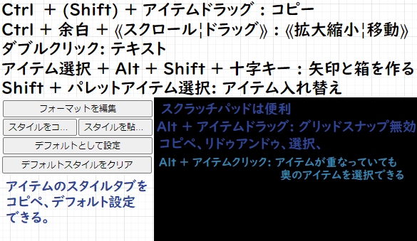

# 色々なソフトの操作メモ

## ソフトの設定したかったら"ソフト名 設定 おすすめ" で検索

## QTTabBar

- タブ操作
  - タブバーをダブルクリック: 直近の**タブを復元**
  - フォルダアイコンを**中クリック**: **新しいタブ**で開く
  - タブの上でスクロール: タブが切り替わる
- 移動  
  - タブ左側右クリック: フォルダを**遡れる**
  - エクスプローラーの**空白をダブルクリック**で上に移動する
- グループ  
  - ★ => 全てのタブから**新規グループ**を作成: 開いているタブを記憶できる
  - タブ右側右クリック => **グループに追加**: タブグループに追加できる
- Windowsロゴのランチャにファイルを**ドラック**して**開ける。追加**もできる
- Crtl + Z: ゴミ箱に捨てたファイルを戻せる
- [他のビューで開く(V)の解除](images\QTTabBar.png)

## Clibor

- Ctrl * 2: Clibor画面表示
- Clibor画面ダブルクリック: Clibor画面表示、常に表示
- ホイール: ページ切り替え
- 上下矢印(↑↓) or 0~9: 候補選択

## Rapture

- 自動コピーにしてあるから Win + V から貼り付けできる
  - Picasa=>コンテキストメニューからコピーできる
- スクショキー押してからMLB: 対象のWindowをキャプチャ(Raptureの画像(重ね,縮小)をMLBすると重ねた状態でキャプチャできる)
- Shift + 左ドラッグ: 領域選択
- Ctrl + ⟪C¦V⟫: コピペ
- Ctrl + T: トリミング
- Ctrl + ⟪E¦R⟫: ⟪縦¦横⟫ぶっこ抜き
- Shift + ⟪W¦S¦A¦D⟫ 連結
- Ctrl + ⟪Z¦Y⟫: ⟪アン¦リ⟫ドゥ
- Ctrl + 左ドラッグ: お絵かき
- テキストも書けるよ
- [Rapture使い方](https://freesoft-100.com/review/rapture.html)
- [ウィンドウズのスクショとの画像比較(劣化なし)](C:\Users\asreia\Downloads\rapture-2.4.1\ウィンドウズのスクショとの画像比較)

## VScode拡張 OverType: VScodeに何故か無いInsertをできるようにするが、全角スペースを打つと全角分文字が消えるので無効にしてある

## ショートカットキー

- Win + 矢印: ウィンドウをスナップする
- Win + Alt + R: 録画
- Win + L: ロック画面
- Win + v: クリップボード
- Alt + D => Alt + Enter: ブラウザタブ複製
- Alt + ~ :(~)のショートカットキー
- ChgKey15で変えた所
  - 変換: デリート
  - Kana: スクリーンショット
  - Kana + Shift: 大文字、小文字 切り替え
  - Kana + Ctrl: **DeepL画像翻訳**
- Power Toys
  - Win + Ctrl + A: ウィンドウを手前に表示
  - Win + Shift + C: **カラーピッカー**
  - Alt + Space: **クイックランチャー**

## LICEcap

- **FPS, Size, title** 以外は特に設定する必要は無いと思う。
- ポーズのショートカットキー(**Ctrl+Alt+P**)
- [映像を撮るとサイズが激重](C:\Users\asreia\AppData\Roaming\Microsoft\Windows\Start Menu\Programs\LICEcap\Test_Gif_LICEcap)
- [『LICEcap』使い方](https://report.hot-cafe.net/licecap-how-to-4361)
- 録画画面
  - Max FPS: フレームレート, Size: 画面サイズ
- 保存画面(設定)
  - title frame: タイトルが入る。Big font: 少し文字が大きくなる
  - elapsed time: 右下に経過時間表示
  - mouse button press: マウス押下の表示
  - Control+Alt+P pauses recording: ポーズのショートカットキー
  - .GIF repeat count (0=infinite): リピートする回数
  - Use .GIF transparency for smaller files: 直訳すれば、GIFを透明化することで、ファイルを小さくするとのこと(らしい)
  - Automatically stop after 録画時間指定

## Draw.io

- 十字キー + (Ctrl) + (Shift): アイテムの移動(Ctrl:伸びる, Shift:スナップ)
- MMB + ドラッグ: 移動
- Ctrl + スクロール: 拡大縮小

## AutoHotkey

- ｢ショートカットキー｣:: Run, ｢実行ファイル｣＠❰, ｢作業フォルダ｣❱
  - 例: Pause:: Run, C:\Users\asreia\Downloads\rapture-2.4.1\rapture.exe, C:\Users\asreia\Downloads\rapture-2.4.1
  - スタートアップに登録: C:\Users\asreia\AppData\Roaming\Microsoft\Windows\Start Menu\Programs\Startup
- [使い方](https://www.youtube.com/watch?v=APjG2RODCzc)
- [サンプルコード週](http://ahkwiki.net/SampleCodes)

## Twinkle Tray: Brightness Slider 明るさを変えるだけ

## Quick Look ファイルでスペースを押すだけで簡単プレビュー(矢印キーでファイルを切り替えられる)

## Power Toys keyboard Manager : **ショートカットキー**をいくつか**登録**している

- 

## ChgKey15 **レジストリでキーマップを変更**している(2箇所)

- [キーボード入力テスト](https://www.onlinemictest.com/ja/keyboard-test/)
- [NumLockってなんで存在するの？](https://www.youtube.com/watch?v=pPwJmOMfrZQ)
  - 問題起きたらScrollLockキーに変える
  - [他の候補](https://www.youtube.com/watch?v=zyqT0vSUeiE)
